# MZ 文本提取现行规格

本文记录已经确认并落地的 MZ 提取行为，包括外部意图、标准资产模型、并发与资源
配置，以及文件系统、CPU、SQLite 与 Lua 生产根组成的完整执行边界。

## 1. 一次调用与执行顺序

一次 `extract` 调用可以同时选择固定提取、Rules JSON 和 Lua，也可以只选择其中
一项。选择至少包含一项；实际执行顺序固定为：

```text
取得项目租约
    ↓
打开项目一次
    ↓
Builtin（若选择）
    ↓
Rules（若选择）
    ↓
Lua（若选择）
```

`ExtractService` 始终按 `Builtin → Rules → Lua` 串行执行，因为三个阶段会修改同一
项目数据库。任一阶段失败便停止后续阶段；已成功提交的前序阶段保持提交，不提供
跨阶段的全局回滚。阶段内部的只读 I/O 和纯 CPU 工作可以有界并发，不改变这个提交
顺序。

项目按 `<projects.root>/mz/<name>/project.db` 定位。命令先取得同项目租约，再由开启边界
读取 metadata、验证受管 schema，并重新计算 `source/data + source/js` 的完整 SHA-256
指纹。实际指纹必须等于 metadata 的 `source_snapshot_fingerprint`；否则来源已在
Init 之外变化，Extract 在修改 owner 前失败。Builtin、Rules 和 Lua 因而共同看到
同一份由 Init 确认的冻结来源。

## 2. 标准快照如何表达文本

Builtin 与 Rules 使用相同的复合文本模型，但分别提交自己的快照：

```text
Snapshot
└─ Group：一个有语义关联的游戏对象或事件块
   ├─ kind
   ├─ group_location
   └─ fields[]
      ├─ field_name
      ├─ exact_location
      └─ original_text
```

例如一个道具的 `name` 和 `description` 位于同一 Group，翻译时可以作为一个最小
上下文单元；两个字段仍各有精确地址，因此刷新后只清除真正改变的叶子译文。对话
说话人和正文行、选项块中的每个选项、滚动文本各行也遵循同一原则：整组提供上下
文，逐叶继承译文。

原文按游戏文件中的内容原样保留。只有 `trim().is_empty()` 为真时才跳过；提取层
不修剪、不正规化、不做语言识别，也不因文本与项目源语言不同而忽略它。

精确地址是由来源和步骤组成的结构化值，步骤只有对象键、数组下标和嵌套 JSON
字符串解码边界。Note 和 Comment 还记录标签名及同一容器内的 occurrence。用于
调试的显示字符串不是权威数据，也不会被反向解析，例如：

```text
data/Items.json[10].description
data/Map001.json.events[3].pages[0].list[12].parameters[0]
plugins.js[QuestMenu].Categories<json>[2]<json>.Name
data/Items.json[10].note#Category[0]
```

快照不携带译文、状态、数据库 ID、hash、规则 ID、规则正文或 schema 版本。

## 3. Builtin 固定位置

Builtin 提取以下 RPG Maker MZ 固定字段：

| 来源 | 字段 |
|---|---|
| Actors | `name`、`nickname`、`profile` |
| Classes | `name` |
| Skills | `name`、`description`、`message1`、`message2` |
| Items、Weapons、Armors | `name`、`description` |
| Enemies | `name` |
| States | `name`、`message1`、`message2`、`message3`、`message4` |
| System | `gameTitle`、`currencyUnit`、`terms.basic/commands/params/messages`、`elements`、`skillTypes`、`weaponTypes`、`armorTypes`、`equipTypes` |
| MapNNN | 根对象的 `displayName` |

标准事件覆盖 Map、CommonEvents 和 Troops 中的事件列表：

- `101 + 401`：说话人与连续正文行同组；
- `102`：选项同组，每个选项独立定位；
- `105 + 405`：滚动文本各行同组并独立定位；
- `320`、`324`、`325`：角色名称、昵称、简介。

MapInfos 名称、事件编辑器名称、公共事件名称、敌群名称、动画或图块组名称、开关
和变量名称不属于固定提取；确有翻译需要时通过 Rules 的 `standard_fields` 指定。

## 4. Rules JSON

Rules 只负责快速、明确地定位标准 MZ 数据中的额外文本，不保存工作流元数据，也不
持久化规则本身。完整格式只有五个可选分区：

```json
{
  "notes": {
    "Items.json": {
      "[].note": ["Category", "HelpText"]
    }
  },
  "event_lists": {
    "Map*.json": {
      "events[].pages[].list": ["QuestDescription"]
    },
    "CommonEvents.json": {
      "[].list": []
    },
    "Troops.json": {
      "[].pages[].list": []
    }
  },
  "plugin_parameters": {
    "QuestMenu": ["WindowTitle", "Categories[].Name"]
  },
  "plugin_commands": {
    "QuestBook": {
      "ShowQuest": ["Entries[].Title", "Entries[].Body"]
    }
  },
  "standard_fields": {
    "Items.json": ["[].customShortName", "[].customDescription"]
  }
}
```

五个分区都可以省略。完整 `{}` 表示停用 Rules owner：删除其 owner 状态并级联删除
其标准资产。任意非空合法 Rules 始终保持 owner active，即使当前来源中零命中也提交
active 空快照。顶层未知字段、重复对象键、同一数组内重复定位项和空字符串都属于
规则错误。

路径语言只支持：

```text
A.B
A[].B
A[3].B
["key.with.dot"]
[].field
```

不支持 `$`、正则、递归、过滤表达式或通用 JSONPath。`Map*.json` 只匹配标准
`Map` 加数字文件，不接受 `Map001.json` 这类单图来源；其他来源必须是程序认识的
标准 MZ 数据文件名，非标准 `data/*.json` 一律交给 Lua。

- `notes` 是“来源 → Note 字段路径 → 标签数组”；路径直接指向字符串 `note` 字段，
  末段必须是精确键名 `note`，标签数组非空；
- `event_lists` 是“来源 → 事件命令列表路径 → Comment 标签数组”；路径直接指向
  事件命令数组，非空标签数组只处理连续 `108 + 408` 注释块，空数组表示该列表只
  供 `plugin_commands` 使用；
- `plugin_parameters` 与 `standard_fields` 的数组元素是路径；
- `plugin_commands` 是“插件名 → 命令名 → 路径数组”，只扫描 `event_lists` 明确
  定位的命令数组；
- 出现的分区、来源、插件、命令和路径数组都必须包含明确提取意图；不用的分区直接
  省略；
- Note 只识别简单 `<Tag:value>`；
- 同一来源的同名 Note/Comment 标签只建立一项匹配事实，并在该来源声明它的全部路径
  中联合验收；因此可以用多条路径表达同一标签的可选位置；
- `plugin_parameters` 路径相对于目标插件的 `parameters` 对象，且只处理启用的插件；
  `plugin_commands` 路径相对于事件指令 357 的 `parameters[3]` 参数对象；
- 插件参数与 `357` 命令参数仅在路径需要继续深入时自动解码嵌套 JSON 字符串，
  每一层解码都会写进结构化地址；
- Note 与事件列表的结构路径只负责精确路由，某条路径在实际文档中没有终点时跳过；
  一旦命中，其终点类型必须分别是字符串与事件命令数组；
- 可选路径和声明可以零命中；实际遍历到的中间结构或终点类型与声明冲突，以及重复
  命中同一叶子，仍会使整次 Rules 提取失败；
- `plugin_commands` 非空时必须至少声明一个 `event_lists` 来源；没有插件命令时，
  每个事件列表路径都必须声明至少一个 Comment 标签。

Rules 只访问配置中写出的精确路径，不递归寻找名为 `note` 或 `list` 的字段；未声明
位置中的同名字段及其内容完全不参与提取。

## 5. Owner 快照、五张标准表与状态继承

标准提取只有三个精确 owner：`builtin`、`rules`、`lua`。每个 owner 独立 active 或
inactive，并拥有自己在五张表中的完整标准快照：

| 表 | 承载内容 |
|---|---|
| `entry` | 数据库对象的复合字段，例如道具名称与说明 |
| `system_text` | `System.json` 中的系统文本 |
| `map_text` | 地图显示名等地图级文本 |
| `text_body` | 对话、选项、滚动文本和事件命令文本 |
| `plugin_param` | Rules 命中的插件参数；事件插件命令归入 text body |

五表统一保存 `owner`、group/exact 位置、字段、原文、可空 `translation` 和可空
32 字节 `translation_state`；text body 另存 `unit_type`。主键统一为
`(owner, exact_location)`，owner 外键指向 `standard_asset_owner_state`。
translation 与 state 必须成对存在或成对为 NULL。

一次 Builtin、Rules 或 Lua 标准替换只触碰选中的 owner。成功事务把该 owner 的
`source_snapshot_fingerprint` 更新为当前 metadata 指纹；其他 active owner 保持原
指纹，因而可能继续 stale。Translate 与 WriteBack 在任一 active owner stale 时返回
`ExtractionOutOfDate`，不会混用不同来源世代的资产。

替换时，旧叶只有在以下完整身份相等时才一起继承 translation 与 state：

```text
owner + table + unit_type + exact_location + field_name + original_text
```

group 位置不参与继承身份；新快照仍保存并校验新的 group 语义。身份变化、叶子消失
或新叶都不会继承旧状态。active owner 的新快照与当前快照、当前来源指纹完全相同
时返回 `Unchanged`，不执行写事务；即使叶集合相同，只要 owner 原先 stale，刷新
owner 指纹仍是一次实际状态变化。

Builtin 被选择时提交 active 快照。Rules 的 `{}` 删除 Rules owner 状态并级联删除其
快照；非空规则提交 active 快照，零命中也合法。Extract Lua 通过
`ctx.extract.replace_standard(snapshot)` 提交 active 快照，空 snapshot 表示 active
空集合；`ctx.extract.clear_standard()` 明确停用 Lua owner。Lua 自建 SQL 表不由
标准 Store 扫描或解释。

位置编码和 SQL 参数构造继续有界并行，最终按自然顺序合并为单一短事务。确定未提交
时保留原快照；提交结果未知时返回不确定终态，调用方不得声称某一状态已经生效。

## 6. 有界异步 I/O 与有界 CPU 并行

`MzProjectDocumentReadingService` 已实现以下保序管线：

```text
稳定排列请求
    ↓
有界异步并发读取原始字节
    ↓
有界提交 CPU 解析任务
    ↓
按请求顺序组装完整文档集
```

`all_maps` 只列举一次 `source/data`。标准文件、标准 Map 与 `source/js/plugins.js` 可以并发
读取；读取失败不返回部分文档。JSON 与 `plugins.js` 外壳解析都经 `CpuTaskExecutor`
执行，不占用异步 I/O 执行器线程。`buffered` 同时提供阶段背压、首错与稳定顺序。

Builtin 把独立标准文件、Map、CommonEvents 和 Troops 形成 CPU 工作单元；Rules 按
`notes`、`event_lists`、`standard_fields` 和插件参数的显式来源分桶。各工作单元只
产生局部结果，
不共享可变 Collector，也不产生数据库副作用。全部结果按稳定来源顺序合并，最终
排序和重复地址检查同样经 CPU 根执行器完成。并发数为 1 或大于 1 时，最终快照与
SQLite 事务计划必须完全一致。

阶段上限只限制一次提取可占用的份额；根适配器还必须用进程级预算统一约束文档解析、
Builtin/Rules 匹配和资产编码这些现实消费者。不得使用无界任务、全局默认线程池、
执行器隐式阻塞配额或硬件探测来替代显式配置。

## 7. 外部必填配置

领域规则固定在代码契约中；所有会改变资源、性能、容量、等待时间或持久化策略的
选择，都由外部配置边界建立受信值后显式注入。业务模块不读取配置文件、环境变量
或全局单例，不提供默认值，也不根据硬件或数据规模静默改写参数。

已经进入服务构造契约的配置为：

| 外部配置项 | 注入位置 |
|---|---|
| `projects.root` | 项目工作区创建与项目数据库记录读取服务 |
| `mz.document.read_concurrency` | `MzDocumentReadingConfig` |
| `mz.document.parse_concurrency` | `MzDocumentReadingConfig` |
| `mz.extract.builtin.scan_concurrency` | `BuiltInExtractionConfig` |
| `mz.extract.rules.scan_concurrency` | `RulesExtractionConfig` |
| `mz.extract.store.encode_concurrency` | `MzExtractionAssetStoreConfig` |
| `mz.extract.store.groups_per_encode_job` | `MzExtractionAssetStoreConfig` |

所有并发数与批大小均为非零受信值；配置类型字段私有、没有 `Default`，服务构造时
必须完整提供。`ExtractService`、`ExistingProjectOpeningService` 和
`LuaExtractionService` 没有自身配置需求，因此不创建空 Config。

根适配器实现时，下列配置也必须由外部提供，缺失即在配置边界显式失败：

```text
runtime.cpu.worker_threads
runtime.cpu.queue_capacity
runtime.filesystem.worker_threads
runtime.filesystem.queue_capacity
runtime.sqlite.max_open_connections
runtime.sqlite.short_queue_capacity
runtime.lua.worker_stack_bytes
runtime.lua.memory_limit_bytes_per_vm
runtime.lua.cancel_check_instruction_interval
runtime.lua.host_values

runtime.sqlite.busy_timeout_ms
runtime.sqlite.journal_mode       # delete / truncate / persist / wal
runtime.sqlite.synchronous        # normal / full / extra
```

SQLite 适配器与 Lua Host 打开项目数据库时接收同一连接策略。

下列内容属于产品与领域规格，不是可调配置：`Builtin → Rules → Lua` 顺序、Builtin
字段集合、Rules active 空快照语义、标准 Map 文件命名、非标准 `data/*.json` 交给
Lua、三个 owner、五张资产表以及 state 成对继承和单事务一致性。

## 8. Lua 信任边界

Lua 是用户明确选择并完全信任的本机程序，不建立沙箱。Extract 阶段获得公共
`ctx.project/json/source/mz/db`，并额外获得 `ctx.extract`；`translation`、`llm`、
`output` 和 `write_back` 均为 nil。`source` 只读 Init 冻结来源，`mz` 提供与 Rust
Builtin/Rules 相同的位置和文档构造能力，Lua 无需自行复制 JSON/MZ 定位器。

`ctx.extract.replace_standard` 与 `clear_standard` 是 Lua owner 标准快照的唯一语义
入口。Lua 仍可通过 `ctx.db` 管理自建 schema、事务和跨阶段协议；Rust 不扫描或默认
消费这些自建产物，Host 也不把整个脚本隐式包进长事务。

## 9. 生产依赖树

```mermaid
flowchart TD
    ES["ExtractService"] --> LEASE["ProjectCommandLeaseService"]
    LEASE --> FLEASE["SystemFileSystem<br/>ExclusiveFileLeaseProvider"]
    ES --> AUDIT["MzAuditLedger<br/>audit.jsonl"]
    AUDIT --> JSONL["JsonLinesEventLog<br/>通用追加/轮转/sync_data"]
    ES["ExtractService"] --> OS["ExistingProjectOpeningService"]
    ES --> BS["BuiltInExtractionService"]
    ES --> RS["RulesExtractionService"]
    ES --> LS["LuaExtractionService"]

    OS --> PR["att_mz::project_database<br/>ProjectDatabaseRecordReadingService"]
    OS --> EDR["SystemFileSystem<br/>ExistingDirectoryResolver"]
    OS --> FP["SourceSnapshotFingerprint"]
    FP --> FPFS["SystemFileSystem<br/>DirectoryTreeFingerprinter"]
    PR --> SQ["RusqliteStorage<br/>SqliteQueryExecutor"]

    BS --> DR["MzProjectDocumentReadingService"]
    RS --> DR
    RS --> FR["SystemFileSystem<br/>FileReader"]
    DR --> FR
    DR --> DL["SystemFileSystem<br/>DirectoryLister"]
    DR --> CPU["BoundedCpuExecutor<br/>CpuTaskExecutor"]

    BS --> STORE["MzExtractionAssetStore"]
    RS --> STORE
    BS --> CPU
    RS --> CPU
    STORE --> CPU
    STORE --> ST["RusqliteStorage<br/>SqliteTransactionExecutor"]
    STORE --> LC["MzLocationCodec · 内部纯函数"]

    LS --> HOST["TrustedLuaExecutionHostingService"]
    HOST --> LUA["TrustedLua54Runtime<br/>TrustedLuaRuntimeExecutor"]
    HOST --> SESSION["RusqliteStorage<br/>SqliteInteractiveSessionFactory"]
    HOST --> FR
```



图中每个业务 Service 都已有实现和测试。`BuiltInSnapshotStore`、`RulesSnapshotStore` 与
`MzProjectDocumentReader` 仍是上层消费契约，但已经分别由
`MzExtractionAssetStore` 和 `MzProjectDocumentReadingService` 实现。

## 10. 当前完成边界

`ExtractService`、项目开启、Builtin、Rules、Lua、项目数据库记录读取、MZ 文档读取
和标准资产 Store 通过以下生产根运行：

```text
SystemFileSystem
BoundedCpuExecutor
RusqliteStorage
TrustedLua54Runtime  // 只在显式 --lua 时构造
```

`ProductionMzCommandRunner` 仅解析并构造当前 Extract 实际选择的配置与根。显式
`--lua` 时每次脚本使用一个专用 OS 线程和一个 SQLite 交互会话。`run_started`
确认后才取得项目租约；业务与非审计根终结后记录
`run_finished`，最后关闭 Audit Ledger。只有命令、审计和全部 shutdown 都成功后才
输出“提取完成”。
