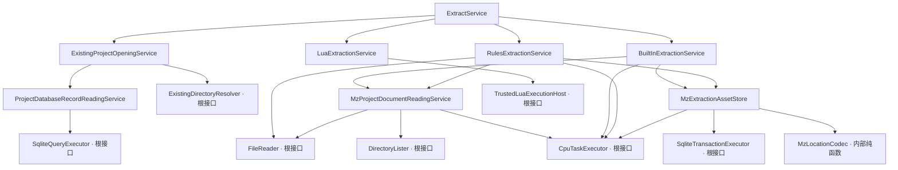

# MZ 文本提取现行规格

本文记录已经确认并落地的 MZ 提取行为。它描述当前外部意图、标准资产模型、并发与
资源配置，以及已经实现到哪一层。文件系统、CPU、SQLite 与 Lua 的生产根适配器仍
不属于当前实现。

## 1. 一次调用与执行顺序

一次 `extract` 调用可以同时选择固定提取、Rules JSON 和 Lua，也可以只选择其中
一项。选择至少包含一项；实际执行顺序固定为：

```text
打开项目一次
    ↓
Builtin（若选择）
    ↓
Rules（若选择）
    ↓
Lua（若选择）
```

`ExtractService` 始终按 `Builtin → Rules → Lua` 串行执行，因为三个阶段会修改同一
项目数据库。任一阶段失败便停止后续阶段；已成功提交的前序阶段保持提交，不提供
跨阶段的全局回滚。阶段内部的只读 I/O 和纯 CPU 工作可以有界并发，不改变这个提交
顺序。

## 2. 标准快照如何表达文本

Builtin 与 Rules 使用相同的复合文本模型，但分别提交自己的快照：

```text
Snapshot
└─ Group：一个有语义关联的游戏对象或事件块
   ├─ kind
   ├─ group_location
   └─ fields[]
      ├─ field_name
      ├─ exact_location
      └─ original_text
```

例如一个道具的 `name` 和 `description` 位于同一 Group，翻译时可以作为一个最小
上下文单元；两个字段仍各有精确地址，因此刷新后只清除真正改变的叶子译文。对话
说话人和正文行、选项块中的每个选项、滚动文本各行也遵循同一原则：整组提供上下
文，逐叶继承译文。

原文按游戏文件中的内容原样保留。只有 `trim().is_empty()` 为真时才跳过；提取层
不修剪、不正规化、不做语言识别，也不因文本与项目源语言不同而忽略它。

精确地址是由来源和步骤组成的结构化值，步骤只有对象键、数组下标和嵌套 JSON
字符串解码边界。Note 和 Comment 还记录标签名及同一容器内的 occurrence。用于
调试的显示字符串不是权威数据，也不会被反向解析，例如：

```text
data/Items.json[10].description
data/Map001.json.events[3].pages[0].list[12].parameters[0]
plugins.js[QuestMenu].Categories<json>[2]<json>.Name
data/Items.json[10].note#Category[0]
```

快照不携带译文、状态、数据库 ID、hash、规则 ID、规则正文或 schema 版本。

## 3. Builtin 固定位置

Builtin 提取以下 RPG Maker MZ 固定字段：

| 来源 | 字段 |
|---|---|
| Actors | `name`、`nickname`、`profile` |
| Classes | `name` |
| Skills | `name`、`description`、`message1`、`message2` |
| Items、Weapons、Armors | `name`、`description` |
| Enemies | `name` |
| States | `name`、`message1`、`message2`、`message3`、`message4` |
| System | `gameTitle`、`currencyUnit`、`terms.basic/commands/params/messages`、`elements`、`skillTypes`、`weaponTypes`、`armorTypes`、`equipTypes` |
| MapNNN | 根对象的 `displayName` |

标准事件覆盖 Map、CommonEvents 和 Troops 中的事件列表：

- `101 + 401`：说话人与连续正文行同组；
- `102`：选项同组，每个选项独立定位；
- `105 + 405`：滚动文本各行同组并独立定位；
- `320`、`324`、`325`：角色名称、昵称、简介。

MapInfos 名称、事件编辑器名称、公共事件名称、敌群名称、动画或图块组名称、开关
和变量名称不属于固定提取；确有翻译需要时通过 Rules 的 `standard_fields` 指定。

## 4. Rules JSON

Rules 只负责快速、明确地定位标准 MZ 数据中的额外文本，不保存工作流元数据，也不
持久化规则本身。完整格式只有五个可选分区：

```json
{
  "notes": {
    "Items.json": ["Category", "HelpText"]
  },
  "plugin_parameters": {
    "QuestMenu": ["WindowTitle", "Categories[].Name"]
  },
  "plugin_commands": {
    "QuestBook": {
      "ShowQuest": ["Entries[].Title", "Entries[].Body"]
    }
  },
  "comments": {
    "Map*.json": ["QuestDescription"]
  },
  "standard_fields": {
    "Items.json": ["[].customShortName", "[].customDescription"]
  }
}
```

五个分区都可以省略，`{}` 表示提交一个空 Rules 快照并删除旧 Rules 资产。顶层未知
字段、重复对象键、同一数组内重复定位项和空字符串都属于规则错误。

路径语言只支持：

```text
A.B
A[].B
A[3].B
["key.with.dot"]
[].field
```

不支持 `$`、正则、递归、过滤表达式或通用 JSONPath。`Map*.json` 只匹配标准
`Map` 加数字文件；非标准 `data/*.json` 一律交给 Lua。

- `notes` 和 `comments` 的数组元素是精确标签名；
- `plugin_parameters` 与 `standard_fields` 的数组元素是路径；
- `plugin_commands` 是“插件名 → 命令名 → 路径数组”；
- Note 只识别简单 `<Tag:value>`；
- Comment 只处理连续 `108 + 408` 注释块；
- 插件参数与 `357` 命令参数仅在路径需要继续深入时自动解码嵌套 JSON 字符串，
  每一层解码都会写进结构化地址；
- 每条定位必须至少命中一个非纯空白字符串，零命中、命中非字符串或重复命中同一
  叶子都会使整次 Rules 提取失败。

大量规则按来源分桶并编译为前缀树。每个实际文档只创建一个 CPU 来源工作单元；
同一分区内的全部路径共享不可变前缀树，标准字段、Note 与事件协议各自至多执行一
趟所需扫描，不按“规则数 × 文档大小”反复扫描。

## 5. 五张标准资产表与快照替换

`MzExtractionAssetStore` 已实现 Builtin 与 Rules 共用的持久化算法。标准资产落入五
张领域表：

| 表 | 承载内容 |
|---|---|
| `entry` | 数据库对象的复合字段，例如道具名称与说明 |
| `system_text` | `System.json` 中的系统文本 |
| `map_text` | 地图显示名等地图级文本 |
| `text_body` | 对话、选项、滚动文本和事件命令文本 |
| `plugin_param` | Rules 命中的 `plugins.js` 插件参数；事件中的插件命令参数归入 `text_body` |

五张表都直接保存 `owner`、`group_location`、`exact_location`、`field_name`、
`original_text` 和可空 `translation`；`text_body` 另存明确的 `unit_type`。不建立
通用 `translations`、`text_units` 或规则持久化表。结构化地址由内部纯函数
`MzLocationCodec` 确定性编码，调试显示字符串仍不作为存储协议。

Store 按外部指定的 Group 批大小切分拥有型工作单元，把位置编码、五表映射和 SQLite
参数构造交给 CPU 根执行器有界并行。编码结果按原 Group 顺序稳定合并，随后构造一
个完整的 SQLite 事务计划。一次快照始终使用一个连接和一个写事务顺序执行 SQL，
不会用多个线程同时修改同一个事务。

Builtin 和 Rules 各自只替换自己拥有的叶子，不删除另一来源的叶子，也不扫描或
修改 Lua 自建表。两种来源可以共享一个 Group，但不能拥有同一个精确叶子；冲突时
整次替换失败。事务内的替换规则为：

- 地址相同且原文相同：继承该叶子的旧译文；
- 地址相同但原文改变：只清除该叶子的译文；
- 新叶子：进入未翻译状态；
- 新快照中消失的旧叶子：连同旧译文删除；
- 驱动确认未提交：保留旧快照；事务始终不会留下部分快照；
- 提交结果未知：明确返回不确定终态，调用方不能擅自断言旧快照或新快照哪一个生效。

## 6. 有界异步 I/O 与有界 CPU 并行

`MzProjectDocumentReadingService` 已实现以下保序管线：

```text
稳定排列请求
    ↓
有界异步并发读取原始字节
    ↓
有界提交 CPU 解析任务
    ↓
按请求顺序组装完整文档集
```

`all_maps` 只列举一次 `game_root/data`。标准文件、标准 Map 与 `plugins.js` 可以并发
读取；读取失败不返回部分文档。JSON 与 `plugins.js` 外壳解析都经 `CpuTaskExecutor`
执行，不占用异步 I/O 执行器线程。`buffered` 同时提供阶段背压、首错与稳定顺序。

Builtin 把独立标准文件、Map、CommonEvents 和 Troops 形成 CPU 工作单元；Rules 按
实际标准文件、Map、插件参数来源与插件命令来源分桶。各工作单元只产生局部结果，
不共享可变 Collector，也不产生数据库副作用。全部结果按稳定来源顺序合并，最终
排序和重复地址检查同样经 CPU 根执行器完成。并发数为 1 或大于 1 时，最终快照与
SQLite 事务计划必须完全一致。

阶段上限只限制一次提取可占用的份额；根适配器还必须用进程级预算约束多个项目和
未来其他纵向切片的总资源。不得使用无界任务、全局默认线程池、执行器隐式阻塞配额
或硬件探测来替代显式配置。

## 7. 外部必填配置

领域规则固定在代码契约中；所有会改变资源、性能、容量、等待时间或持久化策略的
选择，都由外部配置边界建立受信值后显式注入。业务模块不读取配置文件、环境变量
或全局单例，不提供默认值，也不根据硬件或数据规模静默改写参数。

已经进入服务构造契约的配置为：

| 外部配置项 | 注入位置 |
|---|---|
| `projects.database_root` | 项目数据库创建与记录读取服务 |
| `extract.document.read_concurrency` | `MzDocumentReadingConfig` |
| `extract.document.parse_concurrency` | `MzDocumentReadingConfig` |
| `extract.builtin.scan_concurrency` | `BuiltInExtractionConfig` |
| `extract.rules.scan_concurrency` | `RulesExtractionConfig` |
| `extract.store.encode_concurrency` | `MzExtractionAssetStoreConfig` |
| `extract.store.groups_per_encode_job` | `MzExtractionAssetStoreConfig` |

所有并发数与批大小均为非零受信值；配置类型字段私有、没有 `Default`，服务构造时
必须完整提供。`ExtractService`、`ExistingProjectOpeningService` 和
`LuaExtractionService` 没有自身配置需求，因此不创建空 Config。

根适配器实现时，下列配置也必须由外部提供，缺失即在配置边界显式失败：

```text
runtime.cpu.worker_threads
runtime.cpu.queue_capacity
runtime.filesystem.max_active_operations
runtime.filesystem.queue_capacity
runtime.sqlite.max_active_databases
runtime.sqlite.queue_capacity
runtime.lua.max_active_scripts
runtime.lua.queue_capacity

database.busy_timeout
database.journal_mode       # delete / truncate / persist / wal
database.synchronous        # normal / full / extra
```

SQLite 适配器与 Lua Host 打开项目数据库时必须接收同一连接策略。配置文件格式和加载
位置仍未决定；本轮只固定必填内容、受信类型和注入位置。

下列内容属于产品与领域规格，不是可调配置：`Builtin → Rules → Lua` 顺序、Builtin
字段集合、Rules 零命中失败、标准 Map 文件命名、非标准 `data/*.json` 交给 Lua、
五张资产表以及译文继承和单事务一致性。

## 8. Lua 信任边界

Lua 是用户明确选择并完全信任的本机程序，不建立沙箱。Rust 只向可信宿主提交脚本
路径、业务阶段和完整项目事实；宿主使用同一个项目数据库并注入 `ctx.db`。

Lua 自己拥有 schema、数据身份、译文继承、事务划分和跨阶段协议。Rust 不扫描、
解释、迁移或默认消费 Lua 产物；没有相应阶段的 Lua 脚本时，标准翻译和写回不会
自动消费这些产物。宿主也不隐式把整个脚本包进一个长事务。

## 9. 当前实现依赖树



图中 Service 均已有实现和测试。`BuiltInSnapshotStore`、`RulesSnapshotStore` 与
`MzProjectDocumentReader` 仍是上层消费契约，但已经分别由
`MzExtractionAssetStore` 和 `MzProjectDocumentReadingService` 实现，不再是树的
未实现叶子。

## 10. 当前完成边界

`ExtractService`、项目开启、Builtin、Rules、Lua、项目数据库记录读取、MZ 文档读取
和标准资产 Store 的业务实现已经收束到七个根能力：

```text
ExistingDirectoryResolver
FileReader
DirectoryLister
CpuTaskExecutor
SqliteQueryExecutor
SqliteTransactionExecutor
TrustedLuaExecutionHost
```

这七个根能力目前只有接口和测试替身，没有生产实现或组合根。因此当前可以确认：
有界调度、稳定合并、快照算法、事务计划和完整 Extract 编排在测试中成立；仍不能
宣称真实线程池、真实磁盘、真实 SQLite、真实 Lua 或 `att mz extract` 端到端可用。
根适配器完成后，还必须使用代表性 MZ 游戏验证真实吞吐、背压、线程占用、资源释放
和 SQLite 连接策略。
