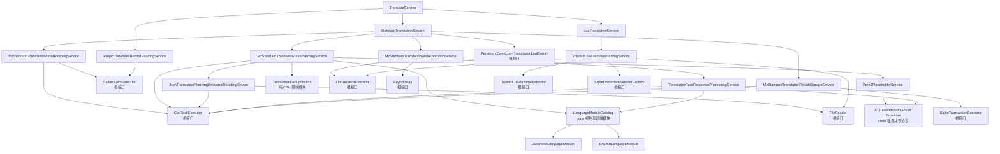

# MZ 翻译现行规格

本文记录当前代码与测试已经建立的 MZ 翻译职责、依赖关系和完成边界。模块接口描述可长期依赖的语义；根接口只代表真实运行机制的停止线，不代表生产适配器已经存在。

## 1. 用户入口与固定执行顺序

```text
att mz translate --name NAME LLM_ID
    [--terms TERMS_JSON]
    [--placeholders PLACEHOLDERS_JSON]
    [--lua SCRIPT_LUA]
```

| 参数 | 语义 |
|---|---|
| `--name NAME` | 选择已经初始化的项目；CLI 将其建立为受信 `ProjectName` |
| `LLM_ID` | 精确选择一份由外部完整建立的翻译执行 Profile |
| `--terms TERMS_JSON` | 本次 Standard 翻译使用的可选权威术语表 |
| `--placeholders PLACEHOLDERS_JSON` | 在固定 MZ 保护规格之外补充的可选 PCRE2 规则 |
| `--lua SCRIPT_LUA` | Standard 正常结束后附加执行的可信 Lua 翻译程序；仍有未翻译原文不会阻止它 |

CLI 只建立命令参数事实，不读取这些文件，也不在命令行重复指定项目 metadata 已有的源语言和目标语言。

- 未传 `--terms`：本次不执行权威术语对账，不等于空术语表。
- 传入合法的 `[]`：权威术语集合为空，删除或变化的旧依赖需要失效。
- 未传 `--placeholders`：没有自定义规则，但固定的 MZ 控制符保护仍然生效。
- 相对路径原样进入对应语义边界，不触发隐式文件发现。

`TranslateService` 的顺序固定为：

```text
精确选择一次 Profile
        ↓
读取一次项目记录
        ↓
StandardTranslationService
        ↓ 正常结束且传入 --lua
LuaTranslationService
        ↓
返回带 Standard 运行摘要的 TranslateOutput
```

Standard 的 Complete、Partial 与 Unavailable 都是正常业务结果；尚有未翻译原文时仍继续显式传入的 Lua。只有不可恢复请求错误、CPU/语言/内部不变量故障、SQLite 终态错误或持久日志失败等技术错误才立即停止并阻止 Lua。Standard 与 Lua 使用同一个不可变 Profile 快照；顶层不重读配置、不猜测提交范围，也不回滚下层已经确认提交的结果。

正常完成时 CLI 返回退出码 0、stderr 为空，并输出 Standard 的任务、写入和剩余摘要；传入 Lua 时额外显示 Lua 已执行。Partial 或 Unavailable 不伪装成“全部翻译完成”，也不升级为失败退出码。技术错误继续返回退出码 1。

## 2. 完整非根依赖树



图中除明确标注“根接口”的节点外，都是已经进入业务实现层的非根模块。根接口隔离的是操作系统线程、真实文件、SQLite 连接、网络模型请求、异步时钟和 Lua VM 等运行机制。

## 3. Profile 与外部配置

Profile 由组合根一次性建立，再由 `InMemoryTranslationExecutionProfileResolver` 按精确 ID 选择。同一 ID 始终返回同一份 `Arc` 快照；ID 不 trim、不折叠大小写、不提供别名或默认项，错误也不泄露载荷或凭据。

MZ 受信载荷按职责分组：

```text
MzTranslationExecutionPayload<L>
├─ planning
│  ├─ scope_concurrency
│  ├─ max_message_characters
│  └─ 精确语言对 → 完整 system Markdown
├─ execution
│  ├─ network_retry_delays
│  └─ max_network_retry_after
└─ llm
   └─ 根 LLM 适配器消费的不透明配置 L
```

外层 Profile 继续持有非零 `max_in_flight_tasks`。资产解码、结果编码、日英译前判定与残留策略，以及可选的日文引号修复候选也分别要求外部显式传入自己的并发、批量、阈值或规则配置。

所有有意义的资源和策略选择遵循同一规则：

- 配置类型字段私有，在构造时建立不变量；
- 不实现 `Default`，不提供隐式配置构造路径；
- 模块不读取配置文件、环境变量或全局单例；
- 模块不探测 CPU 核数，也不根据数据量自行改写并发或容量；
- system Markdown 完整来自精确语言对配置，业务代码不补写隐藏提示词；
- endpoint、凭据、model、timeout、响应上限、速率与请求选项属于 LLM 根配置。

固定的业务顺序、Builtin 控制符集合、语义范围、严格响应协议和事务承诺不是调优项，不转化为可选配置。

## 4. 内部任务模型

JSON 只存在于人类需要编辑的术语/占位符文件和模型响应边界。语料、计划、任务、验收结果与写入计划都使用字段私有的 Rust 类型。

`TranslationTaskBlock` 持有：

- 稳定 `task_index`、源语言与目标语言；
- 按 MZ 结构排序的复合 Group 和字段单元；
- `Active { id }` 或带内部原因的 `Virtual` 单元模式；
- 原文、保护后文本、领域字段名和应用过的占位符绑定；
- 本任务实际注入的术语及后续持久化所需依赖；
- 完整 system / user Markdown messages；
- 译后处理和原子写入所需的内部身份映射。

活跃 ID 在每个任务内从 0 连续编号。虚原文包括已有有效译文、非源语言、完全受保护、全局重复和直接复用五类；它们都保留在各自的本地语义上下文中，携带保护后文本与占位符绑定，但没有 ID、没有旧译文，也不要求模型返回结果。`Duplicate` 和 `Reused` 的代表关系只存在于内部 Rust 模型中，提示词仍统一显示“仅上下文”。

每个 `ExpectedTranslationOutput` 表达“一份待验收译文、一个代表位置和零到多个传播目标”，并携带该代表在译前得到的 `LanguageAnalysis`。分析事实只保留这一份；用于渲染上下文的 `TranslationTaskUnit` 不重复保存。Executor 使用同一源语言模块和这份分析完成残留检查与可选安全修复，验收一次后生成同样传播结构的 `TranslationPatch`，不会把传播目标复制成彼此无关的翻译决定。

只有 `messages` 发送给模型。表名、owner、数据库地址、结构化位置、正则正文和写回身份不进入用户提示词。`ChatMessageRole` 支持 System、User 与 Assistant，以便 Standard 与可信 Lua 共用同一个 LLM 根契约。

## 5. 资产读取与结果存储

### 5.1 MzStandardTranslationAssetReadingService

Reader 直接依赖 `SqliteQueryExecutor`、`CpuTaskExecutor` 和共享 `MzLocationCodec`：

1. 用一条五表 `UNION ALL` 查询关联术语依赖表，得到同一 SQLite statement 快照；
2. 按外部 `leaves_per_decode_job` 分批；
3. 在 `decode_concurrency` 上限内把位置解码和行校验交给 CPU 根；
4. 按稳定顺序重组复合 Group。

未知资产表、未知单元类型、空白译文、无译文却存在依赖、重复或矛盾依赖都视为存储损坏，不在 Reader 内猜测修复。结构化位置即使能够解码，只要其来源、精确位置变体或 Tag 容器语义与所在标准资产表及 `unit_type` 不一致，同样属于项目数据库损坏；表语义与位置语义的合法矩阵由共享标准资产存储能力唯一校验。

### 5.2 术语依赖事实

译文仍直接保存在五张领域资产表中，不增加通用 translations 表。唯一新增的支持表记录译文实际看到过的术语：

```sql
CREATE TABLE translation_terminology_dependency (
    asset_table      TEXT NOT NULL,
    exact_location   TEXT NOT NULL,
    term             TEXT NOT NULL,
    term_translation TEXT NOT NULL,
    PRIMARY KEY (asset_table, exact_location, term)
)
```

Extract 刷新资产时，只有具体地址、原文和继承的译文都保持相同时才保留术语依赖；原文改变、译文清空或叶子消失时，在同一快照事务中删除对应依赖。

### 5.3 MzStandardTranslationResultStorageService

Store 直接依赖 `SqliteTransactionExecutor`、`CpuTaskExecutor` 和位置编码器。Preparation 与每个任务结果分别形成一个短事务：

- Preparation 同时承载术语失效与已有译文复用。它先核对全部失效位置、复用种子和复用目标的原文、旧译文及旧术语依赖，再清理失效译文，并把种子的译文与依赖复制到所有目标；任一事实过期时整个事务不修改数据库。
- Commit 要求代表及全部传播目标的原文与 Group 未变化、译文仍为 `NULL`、依赖仍为空，再把一份已验收译文及代表任务实际使用的术语依赖原子写入所有位置。
- CPU 编码批次按实际物理叶子计数，并受外部批量与并发上限约束；无论一个代表有多少传播目标，SQLite 写入仍是单个顺序事务计划。
- 同一 Preparation 或 Commit 中出现重复目标、一个位置被多个代表拥有等非法计划时，在生成 SQL 副作用前失败。

外部并发修改映射为 `StalePlan`；确定未提交与提交结果未知保持不同错误语义。出现 `OutcomeUnknown` 后，调用方不得继续声称准确的稳定成功前缀。

项目数据库必须符合本规格的标准结构；不符合时需要重新执行 Extract 建立该结构。

## 6. Planner、语言与外部资源

### 6.1 术语表

```json
[
  {
    "term": "魔法剣",
    "translation": "魔法剑",
    "triggers": ["魔法剣", "魔剣"]
  }
]
```

对象只允许 `term`、`translation`、`triggers`。字符串必须非空且没有首尾空白；term 与 trigger 分别精确唯一。trigger 是区分大小写的 Unicode 字面子串，不是正则。实现使用 Aho-Corasick 一次扫描所有 trigger，并保留重叠命中。

新增术语不清理已有译文；术语删除或译名改变时，只让已经记录该依赖的译文失效。某术语一旦注入任务块，该块所有活跃输出都记录这项依赖，因为它们共同看到了该术语。

### 6.2 占位符规则

整段保护：

```json
[
  {
    "scopes": ["event_dialogue"],
    "pattern": "\\\\SE\\[[^]]+\\]",
    "label": "SOUND_EFFECT"
  }
]
```

保留可翻译命名捕获组：

```json
[
  {
    "scopes": ["plugin_parameter"],
    "pattern": "<name>(?<text>.*?)</name>",
    "label": "NAME_TAG",
    "translate": "text"
  }
]
```

`translate` 缺席时保护整个匹配；存在时必须精确指向一个参与匹配的命名捕获组，组外前后外壳形成语义 token，组内继续翻译。scope 使用稳定领域名或 `all`；label 是大写 ASCII 标识。

自定义规则按文件顺序应用，固定 MZ 控制符拥有最高优先级。内建集合同时保护带参数控制符、既有单字符控制符以及 JSON 解码后由两个反斜杠组成的字面 `\\` 控制符；连续反斜杠按完整内建匹配逐段保护。重叠跨度经确定性区间拆分后，每段原文只由一个绑定负责还原。PCRE2 使用 UTF/UCP 模式并在可用时启用 JIT。占位符服务只保护精确命中的 Builtin 或外部规则；其他反斜杠序列按普通自然文本处理，不警告也不阻断规划。

`⟦ATT_` 是 crate 私有占位协议的保留命名空间。Planner 在生成 token 前拒绝原文中的该前缀，避免自然文本与协议 token 无法区分；生成格式与既有持久化契约保持不变。完整 token 信封的生成、扫描及保留前缀检测由一个共享能力负责，翻译占位生成器、响应验收器和写回残留检查共同复用。

若一个候选 Active 单元在移除全部保护 token 后已不再包含源语言内容，Planner 将它降为虚原文；这使“整段保护”真正表示无需翻译，而不会制造一个只能返回 token 的空任务。

### 6.3 共享 LanguageModule

语言能力位于 crate 级共享领域层，不属于 MZ 私有实现，也不是文件、网络一类的运行根。它只处理语言文本和外部建立的语言策略，不依赖 MZ 位置、数据库表、CLI、占位符 token、控制符或模型协议，因此未来其他引擎可以复用同一语义。

`LanguageModule` 只承担三项职责：

1. 译前判断原文是否需要翻译，并产生后续所需的结构化 `LanguageAnalysis`；
2. 译后根据同一份分析判断是否存在源语言残留；
3. 在能够证明安全时给出可选的阅读风格修复计划。修复前的译文不因此被判错，无法唯一确认时保持原文不动。

语言模块看到的不是占位符字符串，而是引擎无关的 `LanguageText`：

```text
LanguageText
├─ NaturalText("彼は「")
├─ OpaqueBoundary
└─ NaturalText("」と言った")
```

`NaturalText` 是可以分析和修复的自然文本；`OpaqueBoundary` 表示调用方已经保护的内容。模块既看不到 token，也看不到被保护的原值。英文单词不能跨 opaque 边界拼接；同一翻译单元中的日文引号结构可以跨该边界继续配对。模块返回的 `LanguageRepairPlan` 只能描述 `NaturalText` 内经过验证且互不重叠的字符替换，不能删除、移动或改写 opaque 内容。

`LanguageModuleCatalog` 只保存“外部精确源语言 ID → 同一个不可变 `LanguageModule` 实例”：

- ID 不 trim、不折叠大小写，不猜测别名，也没有默认模块；
- 外部可以显式把多个精确 ID 绑定到同一实例；
- Catalog 不存在目标语言分支；
- Planner 与 ResponseProcessor 直接复用同一个 Catalog 和同一个模块；
- 分析类型与所选模块不匹配属于内部不变量破坏，而不是普通译文拒绝。

首版实现两个模块：

- `JapaneseLanguageModule`：出现假名或 CJK 表意文字时认为需要翻译；残留检查只报告达到外部阈值且未被允许项覆盖的真实连续假名片段，不把汉字当作确定残留。它还可以按外部候选引号对执行可选修复。
- `EnglishLanguageModule`：译前判定与译后残留使用两份独立、显式注入的策略；译后只报告与原文真实连续对应的英文复制片段，不把分散单词拼成虚构残留。英文模块不修改译文。

日文引号修复采用“唯一结构才修复”。译前记录当前单元内完整配对的 `「」`、`『』` 顺序和嵌套拓扑；译后只有候选引号的数量、顺序、配对与嵌套拓扑都唯一对应时，才把分隔符改回源文风格：

```text
原文：彼は「これは『勇者』の剣だ」と言った。
模型：他说：“这是‘勇者’之剑。”
修复：他说：「这是『勇者』之剑。」
```

源文或译文不配对、数量变化、嵌套变化、出现多种合法映射，或者需要跨不同翻译 ID 才能成对时，一律原样保留译文。这是“没有执行可选修复”，不会形成拒绝、Unavailable 或技术错误。

目标语言 ID 仍然用于项目 metadata、精确语言对 system Markdown、TaskBlock 语言事实和告诉模型翻译目标；它不再对应目标语言模块。空白、BOM、换行、JSON、ID 和占位符完整性都是通用协议或文本职责，不伪装成任何具体语言能力。

### 6.4 规划算法

`JsonTranslationPlanningResourceReadingService` 并发读取两个可选文件；JSON 解析、Aho-Corasick/PCRE2 编译与语义范围规划均经 CPU 根执行。

Planner 使用两阶段保序流水线：

```text
建立 MZ 自然顺序并判定术语失效
        ↓
按语义范围有界并行：占位符保护、LanguageText 投影与译前分析
        ↓ 保序汇合
一次全局 CPU 去重：确定代表、传播目标与历史译文复用
        ↓
按语义范围有界并行：术语触发、切块与 Active ID 分配
```

去重覆盖当前项目、当前语言对的完整标准资产语料，不受 TaskBlock 或语义范围限制。去重键由原文、保护后文本以及顺序一致的完整占位符绑定共同组成；不 trim、不折叠大小写、不做 Unicode 正规化或模糊匹配。哈希只用于索引，最终仍由 Rust 类型相等性确认。代表位置始终由保序汇合后的 MZ 自然顺序决定，不受 CPU 任务完成顺序影响。

若族内没有有效历史译文，第一个待翻译位置成为 Active，其余位置作为重复虚原文留在自己的上下文中；代表成功后，一份结果传播到所有位置。若存在唯一有效译文，最早的有效位置成为复用种子，缺失或已失效位置在 Preparation 中直接回填，不请求 LLM。多个种子的译文相同也按最早种子的译文与术语依赖复用；译文不同则在数据库修改和模型请求前以 `ConflictingReusableTranslations` 失败。因术语变化失效的译文不能成为种子。

Planner 先按最大仍有关联的 MZ 结构范围组织内容，再按完整 `system + user messages` 的 Unicode 字符数切块：

- 每个标准数据库文件；
- System；
- 整张 Map；
- 每个 CommonEvent；
- 每个 Troop；
- 每个插件。

Map 内保持 displayName、event、page、list、command 的真实结构顺序，不跨 Map 凑满任务。复合 Group 不拆；单 Group 自身超限时显式失败。各语义范围按 `scope_concurrency` 在 CPU 根上有界执行，最终仍按稳定范围顺序合并和编号。

User Markdown 只包含人类可理解的组、字段、活跃 ID/“仅上下文”、保护后的原文与实际术语；不泄露内部存储协议、去重原因或代表关系。仅含虚原文的范围不会生成模型请求。

Planner 固定先保护占位符，再把普通文本与保护区投影为 `LanguageText`，随后调用按精确源语言 ID 选择的 `LanguageModule`。分析结果先暂存在预处理单元中；完成全局去重后，只把自然顺序代表的分析交给对应 `ExpectedTranslationOutput`。虚原文没有待验收输出，不向 Executor 复制分析。历史有效译文与 Preparation 直接复用的译文也不会因新语言模块而被隐式重写。

## 7. 模型执行与响应验收

`LlmRequestExecutor` 是单次、非流式、单 choice、无自动重试的根契约。它返回原始 content、finish reason 与可选 request ID/usage，并将错误区分为 Retryable 与 Fatal；可恢复错误可以携带 `Retry-After`。

`MzStandardTranslationTaskExecutionService`：

1. 每次只发送 TaskBlock 已有的完整 messages；
2. 只有 Retryable 网络错误使用外部 `network_retry_delays` 退避；
3. 每次网络重试使用完全相同的 messages，不追加隐藏“修复提示词”；
4. `Retry-After` 与本地延迟取较大值；超过 `max_network_retry_after` 或耗尽重试预算时，当前任务正常成为 Unavailable；
5. 模型内容只验收一次，不消耗重试预算；
6. Fatal 根错误、异步等待失败、CPU/语言能力不可用和内部不变量错误是技术错误，立即终止 Standard。

`AsyncDelay` 只提供可取消的异步等待，不拥有重试策略。

响应边界只接受一个严格、可完整消费的 JSON 信封：允许首尾空白、至多一个开头 BOM，以及完整包裹全部 JSON 的单层无标记、`json` 或 `JSON` Markdown 围栏。移除信封后，剩余内容必须原样解析为唯一的完整顶层数组；不从前后说明、对象字段或其他任意文本中搜索数组，也不修复尾逗号、注释、引号、逗号、括号、ID 或译文，不删项、不合并项。

模型响应必须是：

```json
[
  { "id": 0, "translation": "……" }
]
```

整个顶层数组先按 wire schema 原子验收：每个元素都必须是只包含 `id` 与 `translation` 的对象，`id` 必须是非负整数或非空 ASCII 十进制字符串，`translation` 必须是字符串。任一元素不是对象、缺少字段、包含未知字段或字段类型非法，都会使整批响应成为 `ModelResponseUnusable`；这类模型内容只验收一次，不触发网络重试，也不从结构仍合法的其他元素中抢救结果。只有整批结构通过后，才按 ID 分桶并独立验收译文内容：

- 唯一且属于预期集合的 ID 独立执行字段、通用文本、占位符和源文残留检查；响应中的完整 ATT token 多重集必须与该 ID 的预期多重集严格相等，允许重排但不允许缺失、重复或额外 token；
- 同一预期 ID 重复出现时，该 ID 的所有候选都拒绝，不任意选择一个；
- 响应未提供的预期 ID 只使对应翻译决定未完成；结构合法但不属于预期集合的未知 ID 记录协议诊断，不污染其他 ID；
- `finish_reason` 非 Stop 时记录诊断；仍能安全解析的完整 ID 继续验收；
- 信封、JSON 或 wire schema 无法完整验收时成为 `Unavailable(ModelResponseUnusable)`；结构通过但所有预期 ID 均不合格时成为 `Unavailable(AllOutputsRejected)`，两者都是正常业务结果而不是技术错误；
- 部分 ID 合格时成为 Partial；所有预期 ID 合格时成为 Complete。

Complete、Partial 与 Unavailable 都是正常业务结果。信封、JSON 或 wire schema 失败必须形成整批结构诊断；结构通过后的缺失、重复、未知 ID、空白译文、无自然语言文本、译文字段中的 BOM、占位符不匹配、额外完整 ATT token、未闭合的 `⟦ATT_` 保留前缀和源文残留也必须进入对应的结构化任务事实，不能因“不抛错”而丢失。单个 ID 的内容错误只拒绝该 ID，其他 ID 仍可形成 Partial；重复虚原文不进入 expected ID 集，模型为其返回结构合法的结果只形成未知 ID 诊断。

译后处理顺序固定为：逐字段形状与原始空白检查 → 已知原控制符规范回 token → 严格校验完整 ATT token 多重集及保留前缀闭合性 → 投影 `LanguageText` → 通用检查译文字段 BOM、规范化 `CRLF/CR` 为 `LF` 并确认存在自然语言文本 → 使用译前 `LanguageAnalysis` 检查源语残留 → 规划并应用可选安全修复 → 把修复映射回未保护文本 → 原样恢复保护片段 → 确认没有保留前缀残留 → 按预期 ID 顺序建立 Patch。已知 token 缺失或重复属于占位符不匹配；额外完整 token 或未闭合保留前缀属于意外占位 token。响应外壳开头可安全移除的 BOM 仍属于有限 JSON 清洗；译文字段内部出现 BOM 则是该 ID 的正常拒绝原因。

源文残留检查发生在可选风格修复之前，避免修复掩盖真实残留；日文引号修复发生在占位符恢复之前，且只能改变已验证的自然文本字符。歧义修复直接跳过，不影响该 ID 合格。每个合格代表译文只验收和还原一次，再连同代表任务实际注入的术语依赖交给 Store 扩散；单个 ID 不合格不会丢弃其他已验收 Patch。

## 8. Standard 并发、部分提交与自然续翻

`StandardTranslationService` 固定执行：

```text
读取一次标准资产快照
        ↓
构造一次完整 TranslationPlan
        ↓
提交术语失效与已有译文复用准备事务
        ↓
按 Profile.max_in_flight_tasks 有界执行 TaskExecutor
        ↓
严格按 task_index 消费结果并记录持久事件
```

模型请求可以乱序完成，Standard 仍按 `task_index` 保序消费：

- Complete：用一个任务事务提交全部合格 Patch；
- Partial：用一个任务事务只提交合格 Patch，未完成 ID 保持未翻译；
- Unavailable：没有 Patch，不调用 Store，继续消费后续任务；
- 技术错误：立即停止；已经提交的事务保持，后序结果不得写数据库。

验收粒度、原子粒度和事务粒度彼此独立：译文按 ID 独立验收；每个代表及其全部去重传播目标必须原子成功；同一任务的所有合格传播族在一个短事务中批量提交。任一代表或传播目标已经变化时，整个任务事务以 `StalePlan` 失败，不允许部分传播。

下一次运行不复用持久化 TaskBlock。Reader 重新读取数据库后，本次已提交译文自然成为 `ExistingTranslation` 虚原文，未完成原文重新成为 Active 并从 0 分配 ID；MZ 语义范围、自然顺序和本地上下文保持，但 Active/Virtual 变化后允许重新装箱。空任务计划仍完成必要的失效与复用准备后正常结束。

Standard 返回结构化运行报告，至少统计计划任务、Complete/Partial/Unavailable 数量、接受的翻译决定、写入位置、未完成决定和位置、协议诊断以及网络重试耗尽任务。剩余数量大于零仍是成功的正常业务结果，并且不阻止显式 Lua。

## 9. 集中持久事件日志

`PersistentEventLog<TranslationLogEvent>` 是 Standard 唯一直接依赖的持久日志根接口。Executor 返回结构化业务结果，Store 只负责数据库事务，TranslateService、CLI 与其他下层模块不分别拼接或持久化任务日志。

日志顺序与数据库可确认事实保持一致：

- 有合格 Patch 的任务先确认事务提交，再追加一次任务事件；
- 如果任务事务技术失败，先尽力追加独立的 `TaskCommitFailed` 事件，保存已经形成的逐 ID 验收与拒绝诊断，但不宣称任何位置已经写入；随后仍以原 Store 错误终止命令；
- 没有 Patch 的 Unavailable 任务直接追加一次任务事件；
- 全部任务正常消费后追加一次运行汇总；
- 日志写入失败表示无法履行已确认的持久可观测性承诺，属于技术错误，停止后续任务并阻止 Lua；已经提交的译文保持。

每个任务事件必须完整体现正常业务结果，而不只记录异常：任务索引、Complete/Partial/Unavailable、网络尝试次数、可选 request ID 与 finish reason、每个合格 ID 的代表位置和完整传播族、未完成 ID/位置、每项拒绝原因、信封/JSON/wire schema 失败以及缺失、重复、未知 ID 等协议事实，以及实际写入的翻译决定和物理位置数量。整批结构不可用与结构通过但所有预期 ID 都不合格都表示“当前任务块无可用译文”，但必须分别保留 `ModelResponseUnusable` 与 `AllOutputsRejected` 及各自诊断；部分不可用也完整记录，不能只记录成功 Patch。

事件默认不包含完整 messages、完整模型响应、密钥或全文原文/译文。日志根返回成功必须表示事件已经达到外部配置声明的持久化终态；仅进入进程内易失队列不算成功。本轮只有根接口和受信事件模型，不实现日志文件、格式、队列、轮转、刷盘或保留策略，也不提供静默丢弃事件的生产实现；这些运行选择必须由未来组合根从外部配置建立。

## 10. 可信 Lua Host

Lua 是用户明确选择并完全信任的本机程序，不建立沙箱。`TrustedLuaExecutionHostingService` 已经把粗粒度 Host 继续实现到四个真实运行根：

- `FileReader`：读取主脚本并返回规范绝对路径；
- `LlmRequestExecutor`：Translate 阶段的 `ctx.llm` 共享 Standard 的模型根与同一 Profile；
- `TrustedLuaRuntimeExecutor`：在专用有界 worker 上运行完整标准库 VM；
- `SqliteInteractiveSessionFactory`：建立同一项目数据库上的交互会话。

Host 注入项目事实、`ctx.phase` 与 `ctx.db`；Translate 阶段额外注入只接收完整 messages 的 `ctx.llm`。Lua 自己拥有提示词、重试、验收、schema、任务、事务和幂等行为；Rust 不扫描、解释或默认消费 Lua 产物。

事务生命周期由 Host 负责：

- 正常返回但事务未结束：回滚并返回 `UnclosedTransaction`；
- 脚本失败或取消：回滚当前事务并关闭会话，先前显式提交保持；
- 主错误和清理错误同时发生：组合保留两者；
- 不支持嵌套事务、隐式长事务或自动提交。

Host 在提交 Runtime 前已经打开项目数据库，因此取消契约也覆盖排队期：Runtime 的
`execute` Future 一旦首次轮询并接管 bindings，无论任务是否已经进入 worker，成功、
失败、排队期取消和运行期取消都必须恰好调用一次 `finalize`。调用 Future 被丢弃也不能
放弃清理；根实现须在自己的受控任务中回滚活动事务并关闭会话。

`require` 和脚本主动文件访问属于 Lua 专用 worker，不得阻塞异步 I/O 执行器线程。

## 11. 根接口与完成边界

TranslateUseCase 的非根业务树已经收束到以下运行根接口：

| 根接口 | 负责的真实机制 |
|---|---|
| `FileReader` | 有界、真正异步或隔离阻塞调用的文件读取 |
| `CpuTaskExecutor` | 有界多线程 CPU worker、队列背压与 panic 隔离 |
| `SqliteQueryExecutor` | 一致只读查询与行返回 |
| `SqliteTransactionExecutor` | 拥有型短事务计划与确定提交终态 |
| `LlmRequestExecutor` | 网络排队、限流、单次请求与响应读取 |
| `AsyncDelay` | 可取消异步等待 |
| `PersistentEventLog<TranslationLogEvent>` | 按顺序接管结构化任务结果与运行汇总并持久化 |
| `TrustedLuaRuntimeExecutor` | 可信 Lua VM、专用 worker 与受控终态 |
| `SqliteInteractiveSessionFactory` | 同连接 query/execute/事务状态/关闭生命周期 |

当前可以声称：

- Standard 的资产读取、两阶段计划、全局确定性去重、历史译文复用、模型执行、一次验收多位置扩散与结果存储业务边界已经成立；
- Standard 的 Complete/Partial/Unavailable 正常结果、按 ID 验收、按传播族原子提交和集中日志依赖边界已经成立；
- Lua Host 的脚本、项目上下文、共享 LLM、数据库会话和事务生命周期编排已经成立；
- TranslateUseCase 全部非根依赖已经实现到真实运行根之前；
- CPU 密集工作和异步等待路径均通过明确根契约隔离，阶段并发和批量选择全部由外部注入。

当前不能声称：

- 真实文件、CPU 线程池、SQLite、网络 LLM 或 Lua VM 已有生产适配器；
- 结构化持久事件日志已有生产适配器；
- 生产组合根已经把这些能力装入 `MzCli`；
- 真实游戏已经完成端到端翻译或达到目标吞吐量。

测试替身可以证明业务顺序、错误边界、确定性和资源上限契约，但真实吞吐、取消后的系统资源释放、数据库终态和网络行为必须等待根适配器与组合根完成后，用代表性 MZ 游戏验证。
