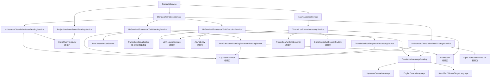

# MZ 翻译现行规格

本文记录当前代码与测试已经建立的 MZ 翻译职责、依赖关系和完成边界。模块接口描述可长期依赖的语义；根接口只代表真实运行机制的停止线，不代表生产适配器已经存在。

## 1. 用户入口与固定执行顺序

```text
att mz translate --name NAME LLM_ID
    [--terms TERMS_JSON]
    [--placeholders PLACEHOLDERS_JSON]
    [--lua SCRIPT_LUA]
```

| 参数 | 语义 |
|---|---|
| `--name NAME` | 选择已经初始化的项目；CLI 将其建立为受信 `ProjectName` |
| `LLM_ID` | 精确选择一份由外部完整建立的翻译执行 Profile |
| `--terms TERMS_JSON` | 本次 Standard 翻译使用的可选权威术语表 |
| `--placeholders PLACEHOLDERS_JSON` | 在固定 MZ 保护规格之外补充的可选 PCRE2 规则 |
| `--lua SCRIPT_LUA` | Standard 全部成功后附加执行的可信 Lua 翻译程序 |

CLI 只建立命令参数事实，不读取这些文件，也不在命令行重复指定项目 metadata 已有的源语言和目标语言。

- 未传 `--terms`：本次不执行权威术语对账，不等于空术语表。
- 传入合法的 `[]`：权威术语集合为空，删除或变化的旧依赖需要失效。
- 未传 `--placeholders`：没有自定义规则，但固定的 MZ 控制符保护仍然生效。
- 相对路径原样进入对应语义边界，不触发隐式文件发现。

`TranslateService` 的顺序固定为：

```text
精确选择一次 Profile
        ↓
读取一次项目记录
        ↓
StandardTranslationService
        ↓ 全部成功且传入 --lua
LuaTranslationService
        ↓
返回 TranslateOutput { name, llm_id }
```

任一阶段失败立即停止。Standard 与 Lua 使用同一个不可变 Profile 快照；顶层不重读配置、不自动重试、不猜测提交范围，也不回滚下层已经确认提交的结果。

## 2. 完整非根依赖树



图中除明确标注“根接口”的节点外，都是已经进入业务实现层的非根模块。根接口隔离的是操作系统线程、真实文件、SQLite 连接、网络模型请求、异步时钟和 Lua VM 等运行机制。

## 3. Profile 与外部配置

Profile 由组合根一次性建立，再由 `InMemoryTranslationExecutionProfileResolver` 按精确 ID 选择。同一 ID 始终返回同一份 `Arc` 快照；ID 不 trim、不折叠大小写、不提供别名或默认项，错误也不泄露载荷或凭据。

MZ 受信载荷按职责分组：

```text
MzTranslationExecutionPayload<L>
├─ planning
│  ├─ scope_concurrency
│  ├─ max_message_characters
│  └─ 精确语言对 → 完整 system Markdown
├─ execution
│  ├─ retry_delays
│  └─ max_retry_after
└─ llm
   └─ 根 LLM 适配器消费的不透明配置 L
```

外层 Profile 继续持有非零 `max_in_flight_tasks`。资产解码、结果编码和英文残留判断也分别要求外部显式传入自己的非零并发、批量或阈值配置。

所有有意义的资源和策略选择遵循同一规则：

- 配置类型字段私有，在构造时建立不变量；
- 不实现 `Default`，不提供隐式配置构造路径；
- 模块不读取配置文件、环境变量或全局单例；
- 模块不探测 CPU 核数，也不根据数据量自行改写并发或容量；
- system Markdown 完整来自精确语言对配置，业务代码不补写隐藏提示词；
- endpoint、凭据、model、timeout、响应上限、速率与请求选项属于 LLM 根配置。

固定的业务顺序、Builtin 控制符集合、语义范围、严格响应协议和事务承诺不是调优项，不转化为可选配置。

## 4. 内部任务模型

JSON 只存在于人类需要编辑的术语/占位符文件和模型响应边界。语料、计划、任务、验收结果与写入计划都使用字段私有的 Rust 类型。

`TranslationTaskBlock` 持有：

- 稳定 `task_index`、源语言与目标语言；
- 按 MZ 结构排序的复合 Group 和字段单元；
- `Active { id }` 或带内部原因的 `Virtual` 单元模式；
- 原文、保护后文本、领域字段名和应用过的占位符绑定；
- 本任务实际注入的术语及后续持久化所需依赖；
- 完整 system / user Markdown messages；
- 译后处理和原子写入所需的内部身份映射。

活跃 ID 在每个任务内从 0 连续编号。虚原文包括已有有效译文、非源语言、完全受保护、全局重复和直接复用五类；它们都保留在各自的本地语义上下文中，携带保护后文本与占位符绑定，但没有 ID、没有旧译文，也不要求模型返回结果。`Duplicate` 和 `Reused` 的代表关系只存在于内部 Rust 模型中，提示词仍统一显示“仅上下文”。

每个 `ExpectedTranslationOutput` 表达“一份待验收译文、一个代表位置和零到多个传播目标”。Executor 验收一次后生成同样结构的 `TranslationPatch`，不会把传播目标复制成彼此无关的翻译决定。

只有 `messages` 发送给模型。表名、owner、数据库地址、结构化位置、正则正文和写回身份不进入用户提示词。`ChatMessageRole` 支持 System、User 与 Assistant，以便 Standard 与可信 Lua 共用同一个 LLM 根契约。

## 5. 资产读取与结果存储

### 5.1 MzStandardTranslationAssetReadingService

Reader 直接依赖 `SqliteQueryExecutor`、`CpuTaskExecutor` 和共享 `MzLocationCodec`：

1. 用一条五表 `UNION ALL` 查询关联术语依赖表，得到同一 SQLite statement 快照；
2. 按外部 `leaves_per_decode_job` 分批；
3. 在 `decode_concurrency` 上限内把位置解码和行校验交给 CPU 根；
4. 按稳定顺序重组复合 Group。

未知资产表、未知单元类型、空白译文、无译文却存在依赖、重复或矛盾依赖都视为存储损坏，不在 Reader 内猜测修复。

### 5.2 术语依赖事实

译文仍直接保存在五张领域资产表中，不增加通用 translations 表。唯一新增的支持表记录译文实际看到过的术语：

```sql
CREATE TABLE translation_terminology_dependency (
    asset_table      TEXT NOT NULL,
    exact_location   TEXT NOT NULL,
    term             TEXT NOT NULL,
    term_translation TEXT NOT NULL,
    PRIMARY KEY (asset_table, exact_location, term)
)
```

Extract 刷新资产时，只有具体地址、原文和继承的译文都保持相同时才保留术语依赖；原文改变、译文清空或叶子消失时，在同一快照事务中删除对应依赖。

### 5.3 MzStandardTranslationResultStorageService

Store 直接依赖 `SqliteTransactionExecutor`、`CpuTaskExecutor` 和位置编码器。Preparation 与每个任务结果分别形成一个短事务：

- Preparation 同时承载术语失效与已有译文复用。它先核对全部失效位置、复用种子和复用目标的原文、旧译文及旧术语依赖，再清理失效译文，并把种子的译文与依赖复制到所有目标；任一事实过期时整个事务不修改数据库。
- Commit 要求代表及全部传播目标的原文与 Group 未变化、译文仍为 `NULL`、依赖仍为空，再把一份已验收译文及代表任务实际使用的术语依赖原子写入所有位置。
- CPU 编码批次按实际物理叶子计数，并受外部批量与并发上限约束；无论一个代表有多少传播目标，SQLite 写入仍是单个顺序事务计划。
- 同一 Preparation 或 Commit 中出现重复目标、一个位置被多个代表拥有等非法计划时，在生成 SQL 副作用前失败。

外部并发修改映射为 `StalePlan`；确定未提交与提交结果未知保持不同错误语义。出现 `OutcomeUnknown` 后，调用方不得继续声称准确的稳定成功前缀。

当前不提供旧开发数据库迁移。已有开发库需要重新执行 Extract 建立最新标准结构。

## 6. Planner、语言与外部资源

### 6.1 术语表

```json
[
  {
    "term": "魔法剣",
    "translation": "魔法剑",
    "triggers": ["魔法剣", "魔剣"]
  }
]
```

对象只允许 `term`、`translation`、`triggers`。字符串必须非空且没有首尾空白；term 与 trigger 分别精确唯一。trigger 是区分大小写的 Unicode 字面子串，不是正则。实现使用 Aho-Corasick 一次扫描所有 trigger，并保留重叠命中。

新增术语不清理已有译文；术语删除或译名改变时，只让已经记录该依赖的译文失效。某术语一旦注入任务块，该块所有活跃输出都记录这项依赖，因为它们共同看到了该术语。

### 6.2 占位符规则

整段保护：

```json
[
  {
    "scopes": ["event_dialogue"],
    "pattern": "\\\\SE\\[[^]]+\\]",
    "label": "SOUND_EFFECT"
  }
]
```

保留可翻译命名捕获组：

```json
[
  {
    "scopes": ["plugin_parameter"],
    "pattern": "<name>(?<text>.*?)</name>",
    "label": "NAME_TAG",
    "translate": "text"
  }
]
```

`translate` 缺席时保护整个匹配；存在时必须精确指向一个参与匹配的命名捕获组，组外前后外壳形成语义 token，组内继续翻译。scope 使用稳定领域名或 `all`；label 是大写 ASCII 标识。

自定义规则按文件顺序应用，固定 MZ 控制符拥有最高优先级。重叠跨度经确定性区间拆分后，每段原文只由一个绑定负责还原。PCRE2 使用 UTF/UCP 模式并在可用时启用 JIT；规划结束仍存在疑似未保护 MZ 控制符时显式失败。

若一个候选 Active 单元在移除全部保护 token 后已不再包含源语言内容，Planner 将它降为虚原文；这使“整段保护”真正表示无需翻译，而不会制造一个只能返回 token 的空任务。

### 6.3 语言目录

`TranslationLanguageCatalog` 通过外部精确语言 ID 绑定实现，不猜测、不回退。首版包含：

- `JapaneseSourceLanguage`：源语言判定与译后日文残留检查；
- `EnglishSourceLanguage`：源语言判定与译后英文残留检查，最小词数、最小字母数和允许项由外部传入；
- `SimplifiedChineseTargetLanguage`：只做确定、安全的规范化与验收，不主观润色，不自动换行。

同一个源语言模块同时负责译前判定和译后残留检查，避免建立两套语言事实。

### 6.4 规划算法

`JsonTranslationPlanningResourceReadingService` 并发读取两个可选文件；JSON 解析、Aho-Corasick/PCRE2 编译与语义范围规划均经 CPU 根执行。

Planner 使用两阶段保序流水线：

```text
建立 MZ 自然顺序并判定术语失效
        ↓
按语义范围有界并行：占位符保护与源语言判定
        ↓ 保序汇合
一次全局 CPU 去重：确定代表、传播目标与历史译文复用
        ↓
按语义范围有界并行：术语触发、切块与 Active ID 分配
```

去重覆盖当前项目、当前语言对的完整标准资产语料，不受 TaskBlock 或语义范围限制。去重键由原文、保护后文本以及顺序一致的完整占位符绑定共同组成；不 trim、不折叠大小写、不做 Unicode 正规化或模糊匹配。哈希只用于索引，最终仍由 Rust 类型相等性确认。代表位置始终由保序汇合后的 MZ 自然顺序决定，不受 CPU 任务完成顺序影响。

若族内没有有效历史译文，第一个待翻译位置成为 Active，其余位置作为重复虚原文留在自己的上下文中；代表成功后，一份结果传播到所有位置。若存在唯一有效译文，最早的有效位置成为复用种子，缺失或已失效位置在 Preparation 中直接回填，不请求 LLM。多个种子的译文相同也按最早种子的译文与术语依赖复用；译文不同则在数据库修改和模型请求前以 `ConflictingReusableTranslations` 失败。因术语变化失效的译文不能成为种子。

Planner 先按最大仍有关联的 MZ 结构范围组织内容，再按完整 `system + user messages` 的 Unicode 字符数切块：

- 每个标准数据库文件；
- System；
- 整张 Map；
- 每个 CommonEvent；
- 每个 Troop；
- 每个插件。

Map 内保持 displayName、event、page、list、command 的真实结构顺序，不跨 Map 凑满任务。复合 Group 不拆；单 Group 自身超限时显式失败。各语义范围按 `scope_concurrency` 在 CPU 根上有界执行，最终仍按稳定范围顺序合并和编号。

User Markdown 只包含人类可理解的组、字段、活跃 ID/“仅上下文”、保护后的原文与实际术语；不泄露内部存储协议、去重原因或代表关系。仅含虚原文的范围不会生成模型请求。

## 7. 模型执行与响应验收

`LlmRequestExecutor` 是单次、非流式、单 choice、无自动重试的根契约。它返回原始 content、finish reason 与可选 request ID/usage，并将错误区分为 Retryable 与 Fatal；可恢复错误可以携带 `Retry-After`。

`MzStandardTranslationTaskExecutionService`：

1. 每次只发送 TaskBlock 已有的完整 messages；
2. 可恢复根错误与模型内容验收失败共用外部 `retry_delays`；
3. 每次重试使用完全相同的 messages，不追加隐藏“修复提示词”；
4. `Retry-After` 与本地延迟取较大值，超过外部 `max_retry_after` 时停止；
5. Fatal 根错误、CPU 不可用和内部不变量错误不重试。

`AsyncDelay` 只提供可取消的异步等待，不拥有重试策略。

响应边界只做有限且可证明安全的 JSON 整理：去除 BOM、单层 Markdown 围栏、从首尾说明中提取唯一完整顶层数组、删除字符串外尾逗号。不补 ID、译文、引号或括号，不删项、不合并项。

模型响应必须是：

```json
[
  { "id": 0, "translation": "……" }
]
```

ID 可以是非负整数或十进制字符串。缺失、重复、未知、额外 ID，未知对象字段或空白译文都会使整个任务失败。输出 ID 集必须与 Active 单元完全一致。重复虚原文不进入 expected ID 集；模型试图为其额外返回译文仍按未知 ID 拒绝。

译后处理顺序固定为：已知原控制符规范回 token → 校验 token 多重集 → 忽略 token 执行目标语言处理和源文残留检查 → 原样恢复保护片段 → 确认没有本任务 token 残留 → 按预期输出顺序建立原子结果。Active 译文在去除 token 后必须仍有有效文本；模型只返回控制符 token 会整任务失败，不能静默删除正文。代表译文只验收和还原一次，之后把同一结果连同代表任务实际注入的术语依赖交给 Store 原子扩散。

## 8. Standard 并发与稳定前缀

`StandardTranslationService` 固定执行：

```text
读取一次标准资产快照
        ↓
构造一次完整 TranslationPlan
        ↓
提交术语失效与已有译文复用准备事务
        ↓
按 Profile.max_in_flight_tasks 有界执行 TaskExecutor
        ↓
严格按 task_index 串行提交任务结果
```

模型请求可以乱序完成，数据库提交不能越过前序任务。任务 `i` 执行或提交失败时，只保留已经确认提交的 `0..i-1`；后序已完成结果被丢弃，尚未开始的请求取消，已经发出的请求也不得自行写数据库。一个已提交的前序代表可以同时填充物理位置位于后续上下文中的重复叶子，这仍属于同一个翻译决定的原子提交。空任务计划仍完成必要的失效与复用准备后成功。

## 9. 可信 Lua Host

Lua 是用户明确选择并完全信任的本机程序，不建立沙箱。`TrustedLuaExecutionHostingService` 已经把粗粒度 Host 继续实现到四个真实运行根：

- `FileReader`：读取主脚本并返回规范绝对路径；
- `LlmRequestExecutor`：Translate 阶段的 `ctx.llm` 共享 Standard 的模型根与同一 Profile；
- `TrustedLuaRuntimeExecutor`：在专用有界 worker 上运行完整标准库 VM；
- `SqliteInteractiveSessionFactory`：建立同一项目数据库上的交互会话。

Host 注入项目事实、`ctx.phase` 与 `ctx.db`；Translate 阶段额外注入只接收完整 messages 的 `ctx.llm`。Lua 自己拥有提示词、重试、验收、schema、任务、事务和幂等行为；Rust 不扫描、解释或默认消费 Lua 产物。

事务生命周期由 Host 负责：

- 正常返回但事务未结束：回滚并返回 `UnclosedTransaction`；
- 脚本失败或取消：回滚当前事务并关闭会话，先前显式提交保持；
- 主错误和清理错误同时发生：组合保留两者；
- 不支持嵌套事务、隐式长事务或自动提交。

Host 在提交 Runtime 前已经打开项目数据库，因此取消契约也覆盖排队期：Runtime 的
`execute` Future 一旦首次轮询并接管 bindings，无论任务是否已经进入 worker，成功、
失败、排队期取消和运行期取消都必须恰好调用一次 `finalize`。调用 Future 被丢弃也不能
放弃清理；根实现须在自己的受控任务中回滚活动事务并关闭会话。

`require` 和脚本主动文件访问属于 Lua 专用 worker，不得阻塞异步 I/O 执行器线程。

## 10. 根接口与完成边界

TranslateUseCase 的非根业务树已经收束到以下运行根接口：

| 根接口 | 负责的真实机制 |
|---|---|
| `FileReader` | 有界、真正异步或隔离阻塞调用的文件读取 |
| `CpuTaskExecutor` | 有界多线程 CPU worker、队列背压与 panic 隔离 |
| `SqliteQueryExecutor` | 一致只读查询与行返回 |
| `SqliteTransactionExecutor` | 拥有型短事务计划与确定提交终态 |
| `LlmRequestExecutor` | 网络排队、限流、单次请求与响应读取 |
| `AsyncDelay` | 可取消异步等待 |
| `TrustedLuaRuntimeExecutor` | 可信 Lua VM、专用 worker 与受控终态 |
| `SqliteInteractiveSessionFactory` | 同连接 query/execute/事务状态/关闭生命周期 |

当前可以声称：

- Standard 的资产读取、两阶段计划、全局确定性去重、历史译文复用、模型执行、一次验收多位置扩散与结果存储业务边界已经成立；
- Lua Host 的脚本、项目上下文、共享 LLM、数据库会话和事务生命周期编排已经成立；
- TranslateUseCase 全部非根依赖已经实现到真实运行根之前；
- CPU 密集工作和异步等待路径均通过明确根契约隔离，阶段并发和批量选择全部由外部注入。

当前不能声称：

- 真实文件、CPU 线程池、SQLite、网络 LLM 或 Lua VM 已有生产适配器；
- 生产组合根已经把这些能力装入 `MzCli`；
- 真实游戏已经完成端到端翻译或达到目标吞吐量。

测试替身可以证明业务顺序、错误边界、确定性和资源上限契约，但真实吞吐、取消后的系统资源释放、数据库终态和网络行为必须等待根适配器与组合根完成后，用代表性 MZ 游戏验证。
