# MZ 翻译现行规格

本文记录 MZ 翻译的现行职责、依赖关系和运行边界。业务模块通过精确根契约协作，生产进程把它们连接到文件、CPU、SQLite、LLM、时钟、Lua 和 JSONL 的真实实现。

## 1. 用户入口与固定执行顺序

```text
att --config FILE mz translate --name NAME PROFILE_ID
    [--terms TERMS_JSON]
    [--placeholders PLACEHOLDERS_JSON]
    [--lua SCRIPT_LUA]
```

| 参数 | 语义 |
|---|---|
| `--name NAME` | 选择已经初始化的项目；CLI 将其建立为受信 `ProjectName` |
| `PROFILE_ID` | 精确选择一份由外部完整建立的翻译执行 Profile |
| `--terms TERMS_JSON` | 用文件内容全量替换项目持久术语快照；省略时复用数据库当前值 |
| `--placeholders PLACEHOLDERS_JSON` | 全量替换项目持久占位符规则快照；省略时复用数据库当前值 |
| `--lua SCRIPT_LUA` | Standard 正常结束后附加执行的可信 Lua 翻译程序；仍有未翻译原文不会阻止它 |

CLI 只建立命令参数事实，不读取这些文件，也不在命令行重复指定项目 metadata 已有的源语言和目标语言。

- 未传某个资源文件：直接复用 `standard_translation_resource` 中该行的规范 JSON；
- 传入合法的 `[]`：明确把对应持久快照清空；
- 传入非空文件：完整替换对应快照，不与数据库旧值合并；
- 占位符快照为空时，固定 MZ 控制符保护仍然生效；
- 相对路径原样进入对应语义边界，不触发隐式文件发现。

`TranslateService` 的顺序固定为：

```text
解析全局语言目录、Prompt 根并精确选择一次 MZ Profile
        ↓
持久化 run_started 并取得项目租约
        ↓
打开项目并复核来源指纹、schema 与 owner freshness
        ↓
从 metadata 取得 LanguagePair，精确解析源语言模块与 MZ Prompt
        ↓
StandardTranslationService
        ↓ 正常结束且传入 --lua
LuaTranslationService
        ↓
返回带 Standard 运行摘要的 TranslateOutput
```

项目来源必须与 metadata 指纹一致，且每个 active owner 的
`source_snapshot_fingerprint` 必须等于 metadata；任一 owner stale 时返回
`ExtractionOutOfDate`，不读取部分新鲜资产继续翻译。

Standard 的 Complete、Partial 与 Unavailable 都是正常业务结果；尚有未翻译原文时仍继续显式传入的 Lua。只有不可恢复请求错误、CPU/语言/内部不变量故障、SQLite 终态错误或强审计失败等技术错误才立即停止并阻止 Lua。Standard 与 Lua 使用配置边界一次选中的同一个 Client 和解析后的翻译语义；只有 Standard 消费 MZ Profile 的 planning、request 与任务并发策略。顶层不重读配置、不猜测提交范围，也不回滚下层已经确认提交的结果。

正常完成时 CLI 返回退出码 0、stderr 为空，并输出 Standard 的任务、写入和剩余摘要；传入 Lua 时额外显示 Lua 已执行。Partial 或 Unavailable 不伪装成“全部翻译完成”，也不升级为失败退出码。技术错误继续返回退出码 1。

## 2. 完整生产依赖树

```mermaid
flowchart TD
    ROOT["ProductionMzCommandRunner"] --> TS
    ROOT --> RESOLVE["MZ 翻译资源精确解析"]
    RESOLVE --> CATALOG["LanguageModuleCatalog"]
    RESOLVE --> FR["SystemFileSystem<br/>FileReader"]
    RESOLVE --> RES["ResolvedMzTranslationResources<br/>LanguagePair + MzSystemPrompt + 源语言模块"]
    TS --> LEASE["ProjectCommandLeaseService"]
    LEASE --> FLEASE["SystemFileSystem<br/>ExclusiveFileLeaseProvider"]
    TS --> AUDIT["MzAuditLedger<br/>audit.jsonl"]
    AUDIT --> JSONL["JsonLinesEventLog<br/>通用追加/轮转/sync_data"]
    TS["TranslateService"] --> ST["StandardTranslationService"]
    TS --> LT["LuaTranslationService"]
    TS --> OPEN["ExistingProjectOpeningService"]
    OPEN --> PR["att_mz::project_database<br/>ProjectDatabaseRecordReadingService"]
    OPEN --> FP["SourceSnapshotFingerprint"]
    FP --> FPFS["SystemFileSystem<br/>DirectoryTreeFingerprinter"]
    TS --> RES

    ST --> AR["MzStandardTranslationAssetReadingService"]
    ST --> PL["MzStandardTranslationTaskPlanningService"]
    ST --> EX["MzStandardTranslationTaskExecutionService"]
    ST --> RS["MzStandardTranslationResultStorageService"]
    ST --> AUDIT

    AR --> SQ["RusqliteStorage<br/>SqliteQueryExecutor"]
    AR --> CPU["BoundedCpuExecutor<br/>CpuTaskExecutor"]

    PL --> LANG["同一 Arc&lt;dyn LanguageModule&gt;<br/>crate 级共享领域模块"]
    PL --> PH["Pcre2PlaceholderService"]
    PL --> STATE["TranslationStateFingerprint"]
    PL --> DEDUP["TranslationDeduplication<br/>纯 CPU 领域模块"]
    PL --> CPU
    RES --> LANG

    EX --> LLM["公共 LlmRequestExecutor 契约<br/>OpenAiChatCompletionExecutor"]
    EX --> DELAY["TokioAsyncDelay<br/>AsyncDelay"]
    EX --> RP["TranslationTaskResponseProcessingService"]
    RP --> LANG
    RP --> CPU
    PH --> TOKEN["ATT Placeholder Token Envelope<br/>crate 私有共享协议"]
    RP --> TOKEN

    RS --> STX["RusqliteStorage<br/>SqliteTransactionExecutor"]
    RS --> CPU

    LT --> LH["TrustedLuaExecutionHostingService"]
    LH --> FR
    LH --> LLM
    LH --> LR["TrustedLua54Runtime<br/>TrustedLuaRuntimeExecutor"]
    LH --> IS["RusqliteStorage<br/>SqliteInteractiveSessionFactory"]

    PR --> SQ
```



图中上层节点拥有翻译语义，带生产实现名称的叶子拥有操作系统线程、真实文件、SQLite 连接、网络请求、异步时钟和 Lua VM 等环境机制。

## 3. Profile、公共 Client 与外部配置

外部 MZ Profile 只保存公共 `llm.clients` 目录中的精确 `llm_client` ID。按命令配置
边界解析完整全局语言目录、CLI 指定的 Profile 及其 Client，验证引用后构造
`MzTranslationProfile<OpenAiChatCompletionClient>`。Profile ID 精确匹配，不 trim、
不折叠大小写、不提供别名或默认项。打开项目后再从 metadata 取得权威
`LanguagePair`，精确选择源语言模块并读取对应的 MZ Prompt。

Profile 与项目相关的解析资源保持不同所有权：

```text
MzTranslationProfile<L>
├─ id
├─ max_in_flight_tasks
├─ planning
│  ├─ scope_concurrency
│  └─ max_message_characters
├─ request
│  ├─ network_retry_delays
│  └─ max_network_retry_after
└─ llm_client
   └─ 公共 LLM 根直接消费的受信 Client L

ResolvedMzTranslationResources
├─ 精确 LanguagePair
├─ MzSystemPrompt
└─ Arc<dyn LanguageModule>
```

Prompt 不属于 Profile。路径固定为
`<prompts.root>/mz/<source>--<target>.md`，其中两个标签均为项目 metadata 的规范
`LanguageId`。只接受该精确路径上的普通 UTF-8 非空白文件，不做大小写、父语言或默认
Prompt 回退。Standard 消费完整 Profile 与解析资源；Lua 只接收同一个 Client、
`LanguagePair`、`MzSystemPrompt` 和语言语义，不获得 planning、request 或任务并发配置。

资产解码、结果编码、日英译前判定与残留策略，以及可选的日文引号修复候选也分别要求
外部显式传入自己的并发、批量、阈值或规则配置。全局 `LanguageModuleCatalog` 以规范
`LanguageId` 为 key，Translate 必须完整验证目录，规范化后重复或实际源语言缺少模块均
显式失败。

所有有意义的资源和策略选择遵循同一规则：

- 配置类型字段私有，在构造时建立不变量；
- 不实现 `Default`，不提供隐式配置构造路径；
- 模块不读取配置文件、环境变量或全局单例；
- 模块不探测 CPU 核数，也不根据数据量自行改写并发或容量；
- system Markdown 完整来自精确语言对 Prompt 文件，业务代码不补写隐藏提示词；
- URL、固定 Bearer API key、model、timeout、RPM/burst 与严格 JSON parameters 属于公共 LLM Client 配置。

固定的业务顺序、Builtin 控制符集合、语义范围、严格响应协议和事务承诺不是调优项，不转化为可选配置。

## 4. 内部任务模型

JSON 只存在于人类需要编辑的术语/占位符文件和模型响应边界。语料、计划、任务、验收结果与写入计划都使用字段私有的 Rust 类型。

Planner 在生成任务前先为全部 active-owner 叶建立当前输入，并将每叶归为：

- `Current`：translation 与 32 字节 state 成对存在，且按当前全部语义重新计算后相等；
- `Stale`：已有 translation/state 不能证明仍对应当前输入；
- `NotApplicable`：源语言分析确认该叶无需翻译；
- `Pending`：需要翻译且没有可复用的当前结果。

分类覆盖全部叶，不只覆盖即将进入某个 TaskBlock 的叶。Stale 和 NotApplicable 的
translation/state 在 Preparation 中成对清除；Current 不写库，Pending 才可能分配
模型 ID。全局重复传播可以在 Preparation 中把同族 Current 结果及其 state 复制到
Pending 目标，使其无需请求模型。

`TranslationTaskBlock` 持有：

- 稳定 `task_index`、源语言与目标语言；
- 按 MZ 结构排序的复合 Group 和字段单元；
- `Active { id }` 或带内部原因的 `Virtual` 单元模式；
- 原文、保护后文本、领域字段名和应用过的占位符绑定；
- 本任务展示的术语，以及每个活跃叶自身实际触发的术语集合；
- 完整 system / user Markdown messages；
- 译后处理和原子写入所需的内部身份映射。

活跃 ID 在每个任务内从 0 连续编号。Current、NotApplicable、完全受保护、全局重复
和直接复用叶作为虚原文保留在自己的语义上下文中，但没有 ID，也不要求模型返回。
`Duplicate` 和 `Reused` 的代表关系只存在于内部 Rust 模型中，提示词统一显示
“仅上下文”。

每个 `ExpectedTranslationOutput` 表达“一份待验收译文、一个代表位置和零到多个传播目标”，并携带该代表在译前得到的 `LanguageAnalysis`。分析事实只保留这一份；用于渲染上下文的 `TranslationTaskUnit` 不重复保存。Executor 使用同一源语言模块和这份分析完成残留检查与可选安全修复，验收一次后生成同样传播结构的 `TranslationPatch`，不会把传播目标复制成彼此无关的翻译决定。

只有 `messages` 发送给模型。表名、owner、数据库地址、结构化位置、正则正文和写回身份不进入用户提示词。`ChatMessageRole` 支持 System、User 与 Assistant，以便 Standard 与可信 Lua 共用同一个 LLM 根契约。

## 5. 资产、持久资源与结果存储

### 5.1 一致读取与 freshness

Reader 用同一条 SQLite statement 在一个快照中读取 metadata 来源指纹、完整 active
owner 集及其来源指纹、固定两行翻译资源和五张标准表。metadata 来源指纹与实际冻结
来源不同，或任一 active owner 指纹与 metadata 不同，都会在规划和资源写入前失败；
后者返回 `ExtractionOutOfDate`。

每叶读取 translation 与 `translation_state`。二者不成对、state 不是 32 字节、未知
owner/表/单元类型、重复物理叶，或位置语义与表及 `unit_type` 不一致，都属于数据库
损坏。Reader 只接受 Init 建立的完整受管 schema，不从显示文本猜位置，也不补造 state。

### 5.2 固定资源快照

`standard_translation_resource` 只包含：

```text
terminology       → canonical_json
placeholder_rules → canonical_json
```

两行始终存在。命令省略文件时使用当前行；传入文件时读取、严格解析并规范编码后全量
替换对应行，合法 `[]` 就是明确空快照。资源替换与逐叶 Preparation 在同一个短事务
中确认，不能出现“新资源已保存但旧 state 尚未清理”的中间状态。

两类资源都必须是唯一完整 JSON 值；任意深度的对象重复键在规范化之前直接拒绝，
不以后出现的值覆盖先出现的值。只有两份显式资源都完成读取、解析与编译后，Planner
才会生成 Preparation，因此其中任一份失败都不会改写数据库资源或逐叶状态。

### 5.3 Preparation 与任务提交

`MzStandardTranslationResultStorageService` 先提交一次 Preparation：保存选中的资源
快照、成对清除 Stale/NotApplicable 叶，并把可证明 Current 的重复结果和相同 state
传播到对应 Pending 目标。事务先精确复核 metadata 来源指纹、完整 owner 集及每个
owner 指纹、两份旧资源快照，再复核受影响叶的 owner、原文和旧
translation/state；任一事实变化时整体 `StalePlan`，不提交部分准备结果。

每个模型任务随后独立短事务提交。代表及全部传播目标的 owner、原文和预期空状态
必须仍一致；一份已验收最终译文及其逐叶 state 原子写入整个传播族。CPU 编码按实际
物理叶计数并有界并行，SQL 仍按自然任务顺序在单连接事务中执行。

没有资源变化、没有待清状态、没有复用传播且全部叶 Current 时，Preparation 不写库，
整个 Translate 产生 0 个 LLM 请求和 0 次资产写入。确定未提交与提交结果未知保持
不同错误语义；`OutcomeUnknown` 后不得声称准确成功前缀。

## 6. Planner、语言与外部资源

### 6.1 术语表

```json
[
  {
    "term": "魔法剣",
    "translation": "魔法剑",
    "triggers": ["魔法剣", "魔剣"]
  }
]
```

对象只允许 `term`、`translation`、`triggers`。字符串必须非空且没有首尾空白；term 与 trigger 分别精确唯一。trigger 是区分大小写的 Unicode 字面子串，不是正则。实现使用 Aho-Corasick 一次扫描所有 trigger，并保留重叠命中。

术语数组以规范 JSON 整体持久化。Planner 对每个叶独立计算实际触发的术语集合；
新增、删除、译名或 trigger 变化只有在改变该叶集合或内容时才改变其 state。TaskBlock
可以展示相关叶术语的并集，但逐叶 state 不把兄弟叶看到的术语算入自身。数据库不
另建术语依赖表。

### 6.2 占位符规则

整段保护：

```json
[
  {
    "scopes": ["event_dialogue"],
    "pattern": "\\\\SE\\[[^]]+\\]",
    "label": "SOUND_EFFECT"
  }
]
```

保留可翻译命名捕获组：

```json
[
  {
    "scopes": ["plugin_parameter"],
    "pattern": "<name>(?<text>.*?)</name>",
    "label": "NAME_TAG",
    "translate": "text"
  }
]
```

`translate` 缺席时保护整个匹配；存在时必须精确指向一个参与匹配的命名捕获组，组外前后外壳形成语义 token，组内继续翻译。scope 使用稳定领域名或 `all`；label 是大写 ASCII 标识。

自定义规则数组同样以规范 JSON 整体持久化。省略命令参数沿用项目当前规则，`[]`
明确清空；没有临时叠加层。每叶 state 记录实际保护结果与完整绑定，因此只要规则
变化没有改变该叶的受保护文本和绑定，该变化本身不会让译文失效。

自定义规则按文件顺序应用，固定 MZ 控制符拥有最高优先级。内建集合同时保护带参数控制符、既有单字符控制符以及 JSON 解码后由两个反斜杠组成的字面 `\\` 控制符；连续反斜杠按完整内建匹配逐段保护。重叠跨度经确定性区间拆分后，每段原文只由一个绑定负责还原。PCRE2 使用 UTF/UCP 模式并在可用时启用 JIT。占位符服务只保护精确命中的 Builtin 或外部规则；其他反斜杠序列按普通自然文本处理，不警告也不阻断规划。

`⟦ATT_` 是 crate 私有占位协议的保留命名空间。Planner 在生成 token 前拒绝原文中的该前缀，避免自然文本与协议 token 无法区分；生成格式与既有持久化契约保持不变。完整 token 信封的生成、扫描及保留前缀检测由一个共享能力负责，翻译占位生成器、响应验收器和写回残留检查共同复用。

若一个候选 Active 单元在移除全部保护 token 后已不再包含源语言内容，Planner 将它降为虚原文；这使“整段保护”真正表示无需翻译，而不会制造一个只能返回 token 的空任务。

### 6.3 共享 LanguageModule

语言能力位于 crate 级共享领域层，不属于 MZ 私有实现，也不是文件、网络一类的运行根。Standard 翻译的译前/译后判断与 Lua `translation.prepare/accept` 当前共同消费这套语义；它只处理语言文本和外部建立的语言策略，不依赖 MZ 位置、数据库表、CLI、占位符 token、控制符或模型协议。

`LanguageModule` 只承担三项职责：

1. 译前判断原文是否需要翻译，并产生后续所需的结构化 `LanguageAnalysis`；
2. 译后根据同一份分析判断是否存在源语言残留；
3. 在能够证明安全时给出可选的阅读风格修复计划。修复前的译文不因此被判错，无法唯一确认时保持原文不动。

语言模块看到的不是占位符字符串，而是引擎无关的 `LanguageText`：

```text
LanguageText
├─ NaturalText("彼は「")
├─ OpaqueBoundary
└─ NaturalText("」と言った")
```

`NaturalText` 是可以分析和修复的自然文本；`OpaqueBoundary` 表示调用方已经保护的内容。模块既看不到 token，也看不到被保护的原值。英文单词不能跨 opaque 边界拼接；同一翻译单元中的日文引号结构可以跨该边界继续配对。模块返回的 `LanguageRepairPlan` 只能描述 `NaturalText` 内经过验证且互不重叠的字符替换，不能删除、移动或改写 opaque 内容。

共享 `LanguageId` 对每个外部标签执行 RFC 5646 解析、IANA 注册表校验和
canonicalization；合法大小写变体进入内部时立即规范化，首尾空白、下划线、非法或
未注册子标签以及主语言 `und` 被拒绝。`LanguagePair` 直接承载两个规范 ID。

`LanguageModuleCatalog` 只保存“规范源语言 ID → 一个不可变 `LanguageModule` 实例”：

- 规范化后重复 ID 直接失败，不猜测别名，也没有默认模块；
- Catalog 不存在目标语言分支；
- Catalog 只在配置解析阶段按源 `LanguageId` 精确选择一次模块；
- Planner 与 ResponseProcessor 直接复用解析结果中的同一个 `Arc<dyn LanguageModule>`；
- 分析类型与所选模块不匹配属于内部不变量破坏，而不是普通译文拒绝。

当前语言目录包含两个模块：

- `JapaneseLanguageModule`：出现假名或 CJK 表意文字时认为需要翻译；残留检查只报告达到外部阈值且未被允许项覆盖的真实连续假名片段，不把汉字当作确定残留。它还可以按外部候选引号对执行可选修复。
- `EnglishLanguageModule`：译前判定与译后残留使用两份独立、显式注入的策略；译后只报告与原文真实连续对应的英文复制片段，不把分散单词拼成虚构残留。英文模块不修改译文。

日文引号修复采用“唯一结构才修复”。译前记录当前单元内完整配对的 `「」`、`『』` 顺序和嵌套拓扑；译后只有候选引号的数量、顺序、配对与嵌套拓扑都唯一对应时，才把分隔符改回源文风格：

```text
原文：彼は「これは『勇者』の剣だ」と言った。
模型：他说：“这是‘勇者’之剑。”
修复：他说：「这是『勇者』之剑。」
```

源文或译文不配对、数量变化、嵌套变化、出现多种合法映射，或者需要跨不同翻译 ID 才能成对时，一律原样保留译文。这是“没有执行可选修复”，不会形成拒绝、Unavailable 或技术错误。

目标 `LanguageId` 仍然用于项目 metadata、精确语言对 MZ Prompt、TaskBlock 语言事实和告诉模型翻译目标；它不对应目标语言模块。空白、BOM、换行、JSON、ID 和占位符完整性都是通用协议或文本职责，不伪装成任何具体语言能力。

### 6.4 逐叶 translation state

`translation_state` 是固定 32 字节 SHA-256，以 domain separation 和逐字段长度 framing
计算。它证明一份最终译文对应以下完整语义：

- 源/目标语言对、当前源语言判定/残留/修复策略及精确 system prompt；
- 公共 Client 的 URL、model 和规范 `parameters`；
- owner、资产表、`unit_type`、字段名、exact 位置和原文；
- 保护后文本、顺序一致的完整占位符绑定和本叶实际触发的术语；
- 最终验收并恢复控制符后的译文全文。

Profile ID、Client ID、API key、网络超时/限流/队列参数、
`max_message_characters`、group 位置、语义 scope 以及兄弟叶上下文不进入 state。
规范 JSON 对象键序和数字表示先统一后哈希，配置中的空白或对象书写顺序不制造状态
变化。已有 translation 参与重算；只有重算值与持久 state 相等才是 Current。

### 6.5 规划算法

资源边界并发读取本次显式提供的文件；省略项从数据库取得规范 JSON。JSON 解析、
Aho-Corasick/PCRE2 编译、逐叶 state 计算与语义范围规划均经 CPU 根执行。

Planner 使用两阶段保序流水线：

```text
建立 MZ 自然顺序并计算每叶 Current/Stale/NotApplicable/Pending
        ↓
按语义范围有界并行：占位符保护、LanguageText 投影与译前分析
        ↓ 保序汇合
一次全局 CPU 去重：确定代表、传播目标与 Current 结果复用
        ↓
按语义范围有界并行：术语触发、切块与 Active ID 分配
```

去重覆盖当前项目、当前语言对的完整标准资产语料，不受 TaskBlock 或语义范围限制。去重键由原文、保护后文本以及顺序一致的完整占位符绑定共同组成；不 trim、不折叠大小写、不做 Unicode 正规化或模糊匹配。哈希只用于索引，最终仍由 Rust 类型相等性确认。代表位置始终由保序汇合后的 MZ 自然顺序决定，不受 CPU 任务完成顺序影响。

若族内没有 Current 译文，第一个 Pending 位置成为 Active，其余 Pending 位置作为
重复虚原文留在自己的上下文中；代表成功后，一份结果按各叶输入分别计算 state 并
传播。若存在唯一 Current 译文，最早 Current 位置成为复用种子，Pending 目标在
Preparation 中直接回填，不请求 LLM。多个 Current 种子的译文不同则在任何数据库
修改和模型请求前以 `ConflictingReusableTranslations` 失败；Stale 结果不能成为种子。

Planner 先按最大仍有关联的 MZ 结构范围组织内容，再按完整 `system + user messages` 的 Unicode 字符数切块：

- 每个标准数据库文件；
- System；
- 整张 Map；
- 每个 CommonEvent；
- 每个 Troop；
- 每个插件。

Map 内保持 displayName、event、page、list、command 的真实结构顺序，不跨 Map 凑满任务。复合 Group 不拆；单 Group 自身超限时显式失败。各语义范围按 `scope_concurrency` 在 CPU 根上有界执行，最终仍按稳定范围顺序合并和编号。

User Markdown 只包含人类可理解的组、字段、活跃 ID/“仅上下文”、保护后的原文与实际术语；不泄露内部存储协议、去重原因或代表关系。仅含虚原文的范围不会生成模型请求。

Planner 固定先保护占位符，再把普通文本与保护区投影为 `LanguageText`，随后调用按精确源语言 ID 选择的 `LanguageModule`。分析结果先暂存在预处理单元中；完成全局去重后，只把自然顺序代表的分析交给对应 `ExpectedTranslationOutput`。虚原文没有待验收输出，不向 Executor 复制分析。已有 Current 译文与 Preparation 直接复用的译文也不会被隐式重写。

## 7. 模型执行与响应验收

`LlmRequestExecutor` 是单次、非流式、唯一数值 index 0、无自动重试的根契约。它返回
原始 content、finish reason、可选的 HTTP `x-request-id`、可选正文 completion ID 和
可选 usage，并将错误区分为 Retryable 与 Fatal；可恢复错误可以携带 `Retry-After`。
HTTP 请求身份与模型响应身份不互相冒充。

MZ 只向这个公共契约提交完整 messages。根固定加入公共 Client 的 `model` 与
`stream=false`；除此之外只透传该 Client 的 `parameters`，MZ 不另行注入
`n`、token 上限或供应商参数。

`MzStandardTranslationTaskExecutionService`：

1. 每次只发送 TaskBlock 已有的完整 messages；
2. 只有 Retryable 网络错误使用外部 `network_retry_delays` 退避；
3. 每次网络重试使用完全相同的 messages，不追加隐藏“修复提示词”；
4. `Retry-After` 与本地延迟取较大值；超过 `max_network_retry_after` 或耗尽重试预算时，当前任务正常成为 Unavailable；
5. 模型内容只验收一次，不消耗重试预算；
6. Fatal 根错误、异步等待失败、CPU/语言能力不可用和内部不变量错误是技术错误，立即终止 Standard。

`AsyncDelay` 只提供可取消的异步等待，不拥有重试策略。

响应边界只接受一个严格、可完整消费的 JSON 信封：允许首尾空白、至多一个开头 BOM，以及完整包裹全部 JSON 的单层无标记、`json` 或 `JSON` Markdown 围栏。移除信封后，剩余内容必须原样解析为唯一的完整顶层数组；不从前后说明、对象字段或其他任意文本中搜索数组，也不修复尾逗号、注释、引号、逗号、括号、ID 或译文，不删项、不合并项。

模型响应必须是：

```json
[
  { "id": 0, "translation": "……" }
]
```

整个顶层数组先按 wire schema 原子验收：每个元素都必须是只包含 `id` 与 `translation` 的对象，`id` 必须是非负整数或非空 ASCII 十进制字符串，`translation` 必须是字符串。任一元素不是对象、缺少字段、包含未知字段或字段类型非法，都会使整批响应成为 `ModelResponseUnusable`；这类模型内容只验收一次，不触发网络重试，也不从结构仍合法的其他元素中抢救结果。只有整批结构通过后，才按 ID 分桶并独立验收译文内容：

- 唯一且属于预期集合的 ID 独立执行字段、通用文本、占位符和源文残留检查；响应中的完整 ATT token 多重集必须与该 ID 的预期多重集严格相等，允许重排但不允许缺失、重复或额外 token；
- 同一预期 ID 重复出现时，该 ID 的所有候选都拒绝，不任意选择一个；
- 响应未提供的预期 ID 只使对应翻译决定未完成；结构合法但不属于预期集合的未知 ID 记录协议诊断，不污染其他 ID；
- `finish_reason` 非 Stop 时记录诊断；仍能安全解析的完整 ID 继续验收；
- 信封、JSON 或 wire schema 无法完整验收时成为 `Unavailable(ModelResponseUnusable)`；结构通过但所有预期 ID 均不合格时成为 `Unavailable(AllOutputsRejected)`，两者都是正常业务结果而不是技术错误；
- 部分 ID 合格时成为 Partial；所有预期 ID 合格时成为 Complete。

Complete、Partial 与 Unavailable 都是正常业务结果。信封、JSON 或 wire schema 失败必须形成整批结构诊断；结构通过后的缺失、重复、未知 ID、空白译文、无自然语言文本、译文字段中的 BOM、占位符不匹配、额外完整 ATT token、未闭合的 `⟦ATT_` 保留前缀和源文残留也必须进入对应的结构化任务事实，不能因“不抛错”而丢失。单个 ID 的内容错误只拒绝该 ID，其他 ID 仍可形成 Partial；重复虚原文不进入 expected ID 集，模型为其返回结构合法的结果只形成未知 ID 诊断。

译后处理顺序固定为：逐字段形状与原始空白检查 → 已知原控制符规范回 token → 严格校验完整 ATT token 多重集及保留前缀闭合性 → 投影 `LanguageText` → 通用检查译文字段 BOM、规范化 `CRLF/CR` 为 `LF` 并确认存在自然语言文本 → 使用译前 `LanguageAnalysis` 检查源语残留 → 规划并应用可选安全修复 → 把修复映射回未保护文本 → 原样恢复保护片段 → 确认没有保留前缀残留 → 按预期 ID 顺序建立 Patch。已知 token 缺失或重复属于占位符不匹配；额外完整 token 或未闭合保留前缀属于意外占位 token。响应外壳开头可安全移除的 BOM 仍属于有限 JSON 清洗；译文字段内部出现 BOM 则是该 ID 的正常拒绝原因。

源文残留检查发生在可选风格修复之前，避免修复掩盖真实残留；日文引号修复发生在占位符恢复之前，且只能改变已验证的自然文本字符。歧义修复直接跳过，不影响该 ID 合格。每个合格代表译文只验收和还原一次，再按每个传播叶的完整 state 输入计算最终 state 后交给 Store；单个 ID 不合格不会丢弃其他已验收 Patch。

## 8. Standard 并发、部分提交与自然续翻

`StandardTranslationService` 固定执行：

```text
读取一次标准资产、owner freshness 与持久资源快照
        ↓
应用本次资源替换并构造全部叶的完整 TranslationPlan
        ↓
事务保存资源、清理 Stale/NotApplicable、传播 Current 复用
        ↓
只为仍是 Pending 的叶按 Profile.max_in_flight_tasks 执行 TaskExecutor
        ↓
严格按 task_index 消费结果并记录持久事件
```

模型请求可以乱序完成，Standard 仍按 `task_index` 保序消费：

- Complete：`accepted` 非空并携带最终响应，用一个任务事务提交全部合格 Patch；
- Partial：`accepted` 与 `unresolved` 都非空并携带最终响应，只提交合格 Patch；
- Unavailable：`unresolved` 非空，可选最终响应和原因，没有 Patch，不调用 Store；
- 技术错误：立即停止；已经提交的事务保持，后序结果不得写数据库。

验收粒度、原子粒度和事务粒度彼此独立：译文按 ID 独立验收；每个代表及其全部去重传播目标必须原子成功；同一任务的所有合格传播族在一个短事务中批量提交。任一代表或传播目标已经变化时，整个任务事务以 `StalePlan` 失败，不允许部分传播。

下一次运行不复用持久 TaskBlock，只从资产、资源和逐叶 state 重新推导。已经提交且
state 仍匹配的叶成为 Current，未完成叶重新成为 Pending 并从 0 分配 ID；语义范围、
自然顺序和本地上下文保持，但状态变化后允许重新装箱。资源与输入完全未变且所有叶
Current 时，空计划直接完成，0 次 LLM、0 次资产写入。

任务结果是上述数据枚举，不另存可矛盾的 status、计数或空 Vec 组合；尝试次数只有一个
`NonZeroUsize` 权威字段，汇总和 audit wire 都从枚举派生。Standard 返回结构化运行
报告，统计任务枚举、接受/写入/未完成位置、协议诊断和网络重试耗尽任务。剩余数量
大于零仍是成功的正常业务结果，并且不阻止显式 Lua。

## 9. 强审计任务事件

Translate 使用四命令共用的 `audit.jsonl`。每个 TaskBlock 在发送第一次模型请求前必须
先持久化 `translation_task_started`；意图未确认时零网络请求。内容验收和数据库提交
或拒绝终态确定后，使用相同 `operation_id` 持久化 `translation_task_finished`。

终态事件完整记录由任务枚举派生的 Complete/Partial/Unavailable、唯一尝试次数、
可选 `provider_request_id`、可选 `provider_response_id`、可选 `final_response_usage`、
finish reason、合格传播族、未完成位置、拒绝原因、协议诊断和已确认写入数。
整批结构不可用与结构通过但全部内容拒绝继续保留不同原因。事件不包含完整 messages、
响应、密钥或全文原文/译文。

任务终态审计失败时，已经确认的数据库提交保持，但命令返回“状态已生效但审计未确认”，
停止后续任务和 Lua。通用 JSONL Runtime 只负责锁、追加、轮转、刷盘与 shutdown；MZ
审计 DTO 和位置 wire 留在 MZ observability 边界。

## 10. 可信 Lua Host

Lua 是用户明确选择并完全信任的本机程序，不建立沙箱。`TrustedLuaExecutionHostingService` 已经把粗粒度 Host 继续实现到四个真实运行根：

- `FileReader`：读取主脚本并返回规范绝对路径；
- `LlmRequestExecutor`：Translate 阶段的 `ctx.llm` 与 Standard 共享同一公共模型根和 Client；
- `TrustedLuaRuntimeExecutor`：为本次唯一脚本启动一个专用 OS 线程和完整标准库 VM；
- `SqliteInteractiveSessionFactory`：建立同一项目数据库上的交互会话。

Host 在公共 `project/json/source/mz/db` 之外注入 Translate 专属的 `translation` 与
`llm`；`extract`、`output`、`write_back` 为 nil。`ctx.translation.system_prompt` 和
`language_pair` 暴露本次已解析的 MZ 翻译语义，`prepare` 直接复用 Rust 的术语触发、
占位符保护、语言分析和逐叶 state 计算。

`prepare` 返回 `PreparedText`，脚本通过 `status` 判断 Current、NotApplicable 或
Pending，使用 `model_text` 与 `terms` 构造自己的 messages，并用 `accept` 复用 Rust
的占位符、源语残留、修复和最终 state 验收。Lua 仍完整拥有如何分组、何时调用 LLM、
重试和事务；`ctx.db` 保留完整 SQL 逃生口，但脚本无需自行复制核心翻译算法。

事务生命周期由 Host 负责：

- 正常返回但事务未结束：回滚并返回 `UnclosedTransaction`；
- 脚本失败或取消：回滚当前事务并关闭会话，先前显式提交保持；
- 主错误和清理错误同时发生：组合保留两者；
- 不支持嵌套事务、隐式长事务或自动提交。

Host 先读取脚本，打开项目唯一 SQLite 交互会话并构造 Host calls 与不可复制的
finalizer，最后用 `runtime.start(...)` 同步移交所有权。`start` 接管后无论线程创建、
Context、Compile、Execute、Binding、
Cancelled 还是 worker panic，都必须产生执行与清理报告并恰好一次终结 session。

`require` 和脚本主动文件访问属于 Lua 专用 worker，不得阻塞异步 I/O 执行器线程。

## 11. 生产根与进程边界

| 生产实现 | 承载的翻译根契约 |
|---|---|
| `SystemFileSystem` | `ExclusiveFileLeaseProvider`、`ExistingDirectoryResolver`、`DirectoryTreeFingerprinter`、`FileReader` |
| `BoundedCpuExecutor` | `CpuTaskExecutor` |
| `RusqliteStorage` | `SqliteQueryExecutor`、`SqliteTransactionExecutor`、`SqliteInteractiveSessionFactory` |
| `OpenAiChatCompletionExecutor` | `LlmRequestExecutor` |
| `TokioAsyncDelay` | `AsyncDelay` |
| `JsonLinesAuditLog` | MZ Audit Ledger 使用的通用追加、轮转与刷盘机制 |
| `TrustedLua54Runtime` | `TrustedLuaRuntimeExecutor` |

`ProductionMzCommandRunner` 在选中 Profile 后取得其已经验证的 `llm_client`，打开
项目后按 metadata 的规范 `LanguagePair` 从全局目录精确选择源语言模块，并读取唯一
`<prompts.root>/mz/<source>--<target>.md`。普通文件、UTF-8 与非空白校验全部通过后才
构造上表中本命令实际需要的根；缺失或非法 Prompt 时不会开始 LLM 请求。Standard 与
Translate Lua 借用同一个 `OpenAiChatCompletionClient` 和
`ResolvedMzTranslationResources`，共享同一个 Executor、HTTP 连接池、客户端限流器
和同一 SQLite 预算；Lua 不借用 MZ Profile 的 planning 或 request 策略。

同项目租约覆盖项目开启、Standard、可选 Lua 和全部数据库提交；超时返回
`ProjectBusy`。可信 Lua 通过 `os.execute` 再调用同项目 ATT 命令也不能重入该租约。

命令结束后按 Lua、LLM、SQLite、FileSystem、CPU 的顺序停止并排空已接管工作，随后
写 `run_finished`，最后关闭 Audit Ledger。只有业务结果、所需任务终态审计与全部
shutdown 都成功后，进程才把 Complete/Partial/Unavailable 摘要写入 stdout。
