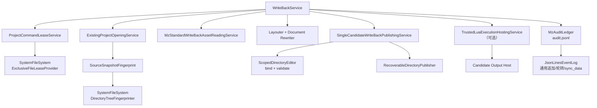

# MZ 写回现行规格

WriteBack 从冻结来源和当前新鲜标准资产构造一个完整候选，让 Standard 与可选 Lua
共同修改这一个候选，最终只发布一次到固定 `write_back/`。命令不会先发布 Standard
再让 Lua 修改可见输出。

## 1. 输入与前置状态

```text
att [--config FILE] mz write-back --name NAME [--lua SCRIPT_LUA]
```

命令先把 `run_started` 写入强审计账本，再取得项目租约并开启项目验证：

- `source/data + source/js` 的实际 SHA-256 等于 metadata；
- `project.db` 严格符合受管 schema；
- 每个 active owner 的来源指纹等于 metadata；任一 stale 返回
  `ExtractionOutOfDate`；
- translation 与 state 成对，写回只消费具有当前 state 的译文。

输出固定为 `<workspace>/write_back/{data,js}`，不读取原游戏目录，不另选目标，也不
根据硬件或内容重新推断 metadata 中的三个布局宽度。

## 2. 唯一执行顺序

```text
run_started 已持久化 → 项目租约
   ↓
读取新鲜标准资产和冻结文档
   ↓
Standard 完整布局与改写计划
   ↓
prepare 一个包含 source/data、source/js 与 Standard overlays 的候选
   ↓ 显式 --lua
Lua 通过 ctx.output / ctx.write_back 修改同一个未发布候选
   ↓
MZ 验证顶层精确为 data/js；文件根复核声明范围、身份与全部预算
   ↓
持久化 write_back_publish_started
   ↓
publish(token) 一次
   ↓
持久化 write_back_publish_finished
```

Standard、Lua 和候选验证中的任何技术失败都会停止流程。候选验证无论是否执行 Lua
都必须发生。整个命令只有一个候选和一次 publish；Lua 始终只作用于未发布候选，目录
交换前没有逐文件可见中间状态。

## 3. Standard 读取、布局与改写

Reader 在一个 SQLite statement 快照中读取五张标准表，解码 group/exact 位置，并
通过共享存储规则校验 owner、表、`unit_type`、来源、Tag 容器和 translation/state。
active owner 跨来源世代、重复物理目标、不可解码位置或语义矛盾都直接失败。

Layouter 只处理三个 metadata 区域：

- `dialogue_body`；
- `scrolling_text`；
- `help_description`。

已有换行是人工硬边界。自动布局无法证明安全时保留完整译文并产生结构化人工诊断，
它仍是正常成功结果。Rewriter 在冻结文档中复核真实路径、事件命令码和原文，然后
生成 data overlays，不直接修改 source 或最终输出。

## 4. 候选中的 Lua

`prepare` 先把完整冻结 `data/js` 与 Standard overlays 组成唯一 staged candidate。
WriteBack Lua 的 `ctx.output` 只绑定这个 candidate；它可以读写、建目录或删除候选内
相对路径，不能访问发布操作。`ctx.write_back.layout` 复用同一个 Rust 布局器和三个
实际宽度。

Lua 仍有 `ctx.db` 完整 SQL 逃生口。脚本显式提交的数据库事务不会因为之后 discard
候选而自动回滚；数据库与目录发布不是同一个原子单元，幂等责任属于可信脚本。

可选 Lua 结束后，MZ WriteBack 验证 candidate 根下必须恰好存在普通 `data/` 和
`js/` 目录；这是领域规则。通用 `ScopedDirectoryEditor` 只绑定候选物理身份与调用方
声明的可编辑顶层 `{data, js}`，验证安全相对路径、声明范围、reparse、硬链接、身份和
条目/深度/字节预算，不内置 MZ 顶层名称。未选择 Lua 时也执行相同最终验证。

`validate` 只借用 candidate，不取得终结权。验证失败时 WriteBack 恰好调用一次
`discard(candidate)`，同时保留验证首因和可能的 discard 次错。验证成功后才检查最终
取消并按值调用 `publish(candidate)`。发布根仍在实际目录交换前重新复核同一物理事实，
防止验证与交换之间的状态变化；这次根复核已接管 token，失败后上层不得再 discard。

## 5. 终结、发布与强审计

prepare 成功后、publish 开始前的任一失败、候选验证失败或取消，只调用一次
`discard(token)`；
discard 成功时旧 `write_back` 完全不变。业务首因与 discard 失败同时保留。

publish 按值消费 token。发布一旦开始，WriteBack 等待明确终态且不得再 discard；
`NotPublished`、`PublishedWithResiduals`、`RecoveryRequired` 和 `OutcomeUnknown` 保持
各自含义，不自动重试或探测降级。

发布前必须先把 `write_back_publish_started` 写入唯一 `audit.jsonl`；意图未确认时
不得调用 publish。目录根返回明确终态后，用同一 `operation_id` 写
`write_back_publish_finished`，其中包含实际宽度、输出根、Standard 汇总、人工诊断和
`lua_executed`。终态审计失败时必须明确报告输出可能或已经生效但审计未确认，不能
回滚、误报未发布或自动重做。

## 6. 依赖与锁顺序



锁顺序固定为项目租约 → `write_back` 发布锁 → SQLite。项目租约超时返回
`ProjectBusy`；不同项目仍可并行。命令与全部根 shutdown 成功后才输出完成结果。
