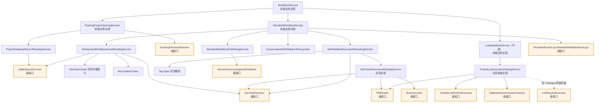

# MZ 写回流程

本文记录当前 WriteBack 已确认的现行契约与完成边界。WriteBack 指把项目数据库中的
标准译文写入一份可供后续封包消费的 MZ `data/`、`js/` 输出，不包含封包，也不把术语
数据当作译文来源。

## 1. 项目工作区

Init 把原 MZ 游戏的完整 `data/` 和 `js/` 目录导入命名项目；后续 Standard Extract 与
WriteBack 都只认识这份冻结副本，不再访问原游戏目录。

```text
<projects_root>/<name>/
├─ project.db
├─ source/
│  ├─ data/
│  └─ js/
└─ write_back/
   ├─ data/
   └─ js/
```

`source/` 的冻结是工具内只读不变量：项目代码不得修改它，每次 Standard 写回都应从
它重新生成输出。本阶段不设置操作系统只读属性，也不保存完整性摘要。

`project.db` 的 metadata 保存项目名、源语言、目标语言，以及对话正文、滚动文本和
帮助说明三个区域的每行最大全角字符数。原游戏路径仅用于 Init 导入，不持久化。

## 2. 顶层执行顺序

```text
按名称打开项目
       ↓
Standard WriteBack
       ↓
Lua WriteBack（仅显式传入脚本时）
```

顶层只编排三个直接能力：`ExistingProjectOpener`、`StandardWriteBack` 和
`LuaWriteBack`。首个技术错误停止后续阶段；已经由依赖确认的副作用不由顶层回滚。

Standard 成功会交回同一个固定最新输出及结构化报告。若用户显式选择 Lua，Lua 接收
该输出继续处理，并完整拥有自己的文件、数据库事务和协议。Lua 失败时命令失败，错误
同时说明脚本路径和已经发布的 Standard 输出路径；顶层不回滚 Standard。

## 3. Standard 业务树与完整依赖

`StandardWriteBackService` 固定执行：读取五表一致快照 → 按稳定顺序选择译文并布局 →
构造 Mutation Plan → 生成候选文档 → 发布固定输出 → 持久记录一次完整发布事件。
五个直接依赖中，Reader、Layouter、Rewriter 和 Publisher 已有真实非根业务实现；
`PersistentEventLog<StandardWriteBackRunLog>` 是已定义但尚无生产适配器的根接口。



上图中的根接口都只定义了环境契约，未实现生产适配器。因此当前能以测试根替身贯通
全部非根业务树，但不能把它等同于生产环境真实写回。

Reader 通过一次无参数 `UNION ALL` 查询读取 `entry`、`system_text`、`map_text`、
`text_body`、`plugin_param` 的八列写回事实。它不读取、关联或校验术语数据，并严格解码
owner、unit type、结构化位置及对话/滚动正文角色。受控 CPU 任务完成分批、并行解码和
最终快照组装；空快照合法。

位置文本能够被 Codec 解码只证明存储格式有效。Reader 还会通过共享标准资产存储语义校验
表/`unit_type` 与 exact/group 的来源、位置变体及 Tag 容器关系；任何不一致都表示项目数据库
已损坏并使整次读取失败。该规则明确允许 Rules 产生的 `Entry → Map`，不根据字段名或深层事件
命令路径猜测资产类别。

`StandardWriteBackSnapshot` 按文本组及精确位置保存原文、可选数据库译文和结构化角色，
不包含术语数据。`StandardWriteBackMutationPlan` 区分普通位置替换与对话/滚动正文块替换，
避免把会改变 401/405 指令数量的结果退化成普通字符串替换。

## 4. 保守布局的已实现规则

布局只作用于对话正文、滚动文本和帮助/说明框；帮助说明只识别 `Skills`、`Items`、
`Weapons`、`Armors` 的规范 `[index].description` 位置。三个区域分别使用 metadata
中显式建立的正整数行宽。

- 对话与滚动文本以完整 401/405 正文块作为布局、统计和回退单元，不在叶子之间移动字符；
- 宽度按 Unicode grapheme 计算：CJK/宽字符为一个全角，ASCII 窄字符为半个全角，组合与零宽字符不占宽度；
- 边界完整的 MZ/插件控制序列作为零宽不可拆原子；残留 ATT token、破损反斜杠序列或控制字符使整单元 `Manual`；
- 自动换行只选择水平空白词界或句/分句标点后的安全断点，不在任意汉字间或超宽位置强切；
- 断点不得产生行首闭合标点、行尾开启符、空行头尾或过短尾行；候选行头至少使用当前可用宽度的 45%；
- 数据库真实 LF 和原 401/405 边界是不计自动新增数的硬边界；缺译叶可参与控制符和括号状态观察，但内容不改；
- Help 在原文没有真实换行时禁止自动新增换行，但仍会处理已有硬续行的全角缩进；
- 先换行，再根据行首包裹符的跨行/嵌套状态补 U+3000 全角空格；已有半角或全角空白时不重复添加；
- 任一局部无法完整证明安全，则撤销整个语义单元的自动换行和缩进，并原样写入数据库译文。

`Manual` 是正常结果：Standard 继续发布并记录一条不包含正文的结构化人工诊断。

## 5. 文档改写、发布与 Lua

`MzWriteBackDocumentRewritingService` 从 Mutation Plan 推导精确标准文件、Map ID 和
`plugins.js` 选择，复用 `MzProjectDocumentReadingService` 读取冻结文档，并在 CPU 根中校验、
改写和序列化。它已支持普通结构路径、多层 `DecodeJsonString`、精确插件参数身份、
Note/Comment Tag occurrence、可扩缩的 Comment 108/408 块，以及对话 401 和滚动文本 405
正文块的逐叶重建、按译文硬换行扩展与部分翻译。每个 `ReplaceWithLines` 叶至少保留一条正文指令，
因此当前契约不把 401/405 收缩列为能力。
任一位置、类型、命令码或预期原文不匹配时，整份内存候选作废，不产生部分文档结果。空 Mutation Plan
返回带项目身份的空候选，不读文档。

`StandardWriteBackPublishingService` 把 `source/data → data`、`source/js → js` 和改写文件覆盖组成
`DirectorySnapshotPublishRequest`，并且只允许发布到当前项目的固定 `write_back_root`。候选项目
身份不匹配、相对路径越界、覆盖重叠均在根调用前失败。`AtomicDirectorySnapshotPublisher`
根将来负责同级暂存、完整递归复制、覆盖、目录交换、失败清理和不越界的符号链接/
reparse point 策略；它目前只有接口，没有生产实现。

发布成功后，Standard 只追加一条 `StandardWriteBackRunLog`。日志失败会阻止 Lua，但不回滚已确认
的输出；错误保留输出路径和日志根错误。

`LuaWriteBackService` 已实现 Published token 项目身份校验和 `LuaInvocation::WriteBack` 交接。
共享 `TrustedLuaExecutionHostingService` 现在从 invocation 变体直接确定 WriteBack 阶段，向脚本提供
冻结 `source_root`、已发布 `output_root`、`project.db`、项目名和语言。WriteBack 不开放
`ctx.llm`；未提交的活动数据库事务由 Host 在终止时回滚和关闭，Lua 已显式确认的文件或数据库
副作用不由 Rust 回滚。

## 6. 当前完成边界

当前已实现 WriteBack 依赖树中的全部非根业务能力，包括顶层用例、Standard 编排、五表查询规则与
解码、保守布局、MZ 文档重建、固定发布请求规划、Lua WriteBack 和共享 Host 阶段交接。
测试根替身可以证明上述非根树的数据流、统计、保守回退和失败终态。

当前仍不能声称生产环境真实写回已成立，因为以下环境根只有接口，尚无生产适配器和组合根接线：

- `SqliteQueryExecutor`、`CpuTaskExecutor`；
- `FileReader`、`DirectoryLister`、`ExistingDirectoryResolver`、`AtomicDirectorySnapshotPublisher`；
- `PersistentEventLog<StandardWriteBackRunLog>`；
- `TrustedLuaRuntimeExecutor`、`SqliteInteractiveSessionFactory`、`LlmRequestExecutor`。

Init 真实递归冻结、真实 SQLite/文件/Lua VM/日志适配器、生产组合根、真实磁盘端到端写回、封包、
历史修订、冻结篡改检测、旧 schema 迁移和行宽修改命令均不在当前完成范围。旧 metadata 不提供兼容
读取或迁移，已有旧项目必须重新执行 Init。
