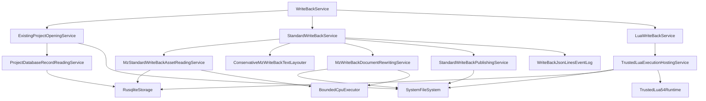

# MZ 写回流程

## 1. 用户结果

```text
att [--config FILE] mz write-back --name NAME [--lua SCRIPT_LUA]
```

写回只使用 Init 冻结的 `source/data`、`source/js`、项目数据库中已验收的译文和 metadata 里的三个实际布局宽度。成功结果固定发布到：

```text
<projects.root>/<name>/write_back/
├─ data/
└─ js/
```

命令不读取原游戏目录，不另选输出路径，也不根据本次环境重新推断行宽。人工布局诊断是正常成功结果；它们说明相应译文已原样写入，需要之后人工调整。

## 2. 顶层顺序

`WriteBackService` 只打开一次项目，然后固定执行：

```text
ExistingProjectOpeningService
        ↓
StandardWriteBackService
        ↓ 发布成功且显式传入 --lua
LuaWriteBackService
        ↓
WriteBackOutput
```

首个技术错误停止后续阶段。Standard 已成功发布的整体输出不因之后的 Lua 失败而回滚。Lua 只能接收同一个项目的 `PublishedWriteBack` 交接令牌，不能用任意路径伪造已发布结果。

## 3. Standard 依赖树



`SystemFileSystem`、`BoundedCpuExecutor`、`RusqliteStorage`、`TrustedLua54Runtime` 和 `WriteBackJsonLinesEventLog` 都由当前命令的生产组合边界构造并显式终结。WriteBack 不构造 LLM，`ctx.llm` 为 `nil`。

## 4. 资产读取与改写

Reader 在同一 SQLite statement 快照中读取五张标准资产表，解码 exact/group 位置并通过共享存储语义校验表种类、`unit_type`、来源、位置变体和 Tag 容器。不可解码或语义矛盾都是项目数据库损坏，不猜测修复。

Layouter 只对三个已定义区域应用对应宽度：

- 对话正文；
- 滚动文本；
- 帮助/说明框。

译文中已存在的换行是人工硬边界。每个文本先尝试自动换行，再为符合条件的续行增加全角空格；无法安全处理时撤销该文本的自动布局，保留完整译文并产生结构化人工诊断。

Rewriter 重新观测冻结文档中的真实路径、事件命令码和原文。任何与提取快照不一致的位置都使本次写回失败，不把译文写到猜测位置。

## 5. 整体发布

Publisher 构造一个意图固定为 `ReplaceExisting` 的候选：

```text
source/data → data
source/js   → js
重写文档    → 对应 data overlay
```

`SystemFileSystem.prepare` 在最终 `write_back` 同父目录建立完整 stage，校验复制预算、Windows 名称、reparse point、物理重叠和目标身份。`publish` 在同目标跨进程锁中通过 journal 与两次 handle rename 切换整目录。它不暴露逐文件半成品。

终态区分 `TargetMissing`、`TargetNotDirectory`、`NotAttempted`、`NotPublished`、`PublishedWithResiduals`、`RecoveryRequired` 和 `OutcomeUnknown`。业务层不降级、不自动重试。

## 6. 持久日志

整体发布成功后，Standard 把项目、实际三个布局宽度、输出根、汇总和完整人工布局诊断交给 `WriteBackJsonLinesEventLog`。进程为运行生成一个 Windows 安全随机 UUID v4 `run_id`；日志根验证事件项目与运行上下文一致。

记录追加到全局 `write_back.jsonl`。只有 `write + LF + sync_data` 全部完成才确认成功；轮转或 retention 失败在记录已落盘时返回 `PersistedButMaintenanceFailed`，不误报为未持久。

## 7. 可信 Lua 与收尾

显式 `--lua` 使用同一个项目 SQLite 根和一个专用 Lua 5.4 VM。Host 先 reserve 运行容量，再打开交互会话，最后同步 start 移交 calls 与唯一 finalizer。Lua 正常返回但留有活动事务时，Host 回滚并返回 `UnclosedTransaction`。

命令结束后固定停止 Lua 准入并等待 finalizer，然后依次终结 SQLite、FileSystem、CPU 和 WriteBack Log。只有命令与全部 shutdown 都成功后才向 stdout 输出“写回完成”。
