# MZ 写回流程

## 1. 用户结果与前置状态

```text
att [--config FILE] mz write-back --name NAME [--lua SCRIPT_LUA]
```

WriteBack 只使用 Init 冻结的 `source/data`、`source/js`、项目数据库中带当前 state 的
译文，以及 metadata 中三个实际布局宽度。成功结果固定发布到：

```text
<projects.root>/<name>/write_back/
├─ data/
└─ js/
```

命令先持久化 `run_started` 并取得项目命令租约，再复核冻结来源 SHA-256、受管 schema 和全部 active owner
freshness。来源或 owner 不同代时直接失败，不混用资产；不同项目仍可并行。

## 2. 顶层顺序

`WriteBackService` 只打开一次项目，并把 Standard 与可选 Lua 的修改汇入同一个未发布
候选：

```text
持久化 run_started，取得 ProjectCommandLease
        ↓
ExistingProjectOpeningService
        ↓
StandardWriteBackService：读取、布局、重写
        ↓
StandardWriteBackPublishingService.prepare
        ↓ 显式传入 --lua
LuaWriteBackService 修改同一 candidate
        ↓
MZ 顶层验证 + 通用候选文件复核（无论是否运行 Lua）
        ↓
AuditLedger.append(write_back_publish_started)
        ↓
publish(token) 一次
        ↓
AuditLedger.append(write_back_publish_finished)
        ↓
WriteBackOutput
```

Standard、Lua、候选验证或取消在 publish 前失败时，WriteBack 只调用一次
`discard(token)`，既有 `write_back` 保持不变。候选验证失败与 discard 失败分别保留，
清理错误不覆盖验证首因。publish 按值接管 token 后，上层等待其明确终态且不得再次
discard。

## 3. 依赖树

```mermaid
flowchart TD
    WB["WriteBackService"] --> LEASE["ProjectCommandLeaseService"]
    LEASE --> FLEASE["SystemFileSystem<br/>ExclusiveFileLeaseProvider"]
    WB --> OPEN["ExistingProjectOpeningService"]
    WB --> STD["StandardWriteBackService"]
    WB --> PUB["StandardWriteBackPublishingService"]
    WB --> LUA["LuaWriteBackService（可选）"]
    WB --> AUDIT["MzAuditLedger<br/>audit.jsonl"]
    AUDIT --> JSONL["JsonLinesEventLog<br/>通用追加/轮转/sync_data"]

    OPEN --> RECORD["ProjectDatabaseRecordReadingService"]
    OPEN --> FP["SystemFileSystem<br/>DirectoryTreeFingerprinter"]
    OPEN --> RESOLVE["SystemFileSystem<br/>ExistingDirectoryResolver"]
    RECORD --> SQLITE["RusqliteStorage"]

    STD --> READER["MzStandardWriteBackAssetReadingService"]
    STD --> LAYOUT["ConservativeMzWriteBackTextLayouter"]
    STD --> REWRITE["MzWriteBackDocumentRewritingService"]
    READER --> SQLITE
    READER --> CPU["BoundedCpuExecutor"]
    REWRITE --> FILES["SystemFileSystem<br/>FileReader / DirectoryLister"]
    REWRITE --> CPU

    PUB --> EDIT["SystemFileSystem<br/>ScopedDirectoryEditor"]
    PUB --> DIR["SystemFileSystem<br/>RecoverableDirectoryPublisher"]
    LUA --> HOST["TrustedLuaExecutionHostingService"]
    HOST --> OUT["Candidate Output Host"]
    HOST --> SQLITE
    HOST --> VM["TrustedLua54Runtime"]
```



WriteBack 不构造 LLM，`ctx.llm` 为 nil。项目租约 → `write_back` 发布锁 → SQLite 是
唯一锁顺序；可信 Lua 也不能通过子进程重入同一个项目。

## 4. Standard 读取、布局与重写

Reader 在一个 SQLite statement 快照中读取五张标准资产表，解码 exact/group 位置，
并通过共享存储语义校验 owner、表种类、`unit_type`、来源、位置变体、Tag 容器和
translation/state。不可解码或语义矛盾都是项目数据库损坏，不猜测修复。

Layouter 只对三个 metadata 区域使用对应宽度：

- 对话正文；
- 滚动文本；
- 帮助/说明框。

译文中的已有换行是人工硬边界。无法证明自动布局安全时，Standard 保留完整译文并
产生结构化人工诊断；这是正常结果。Rewriter 在冻结文档中复核真实路径、事件命令码
和原文，再生成 data overlays，不直接修改 source、候选或固定输出。

## 5. 唯一候选与 Lua

Publisher 以 `ReplaceExisting` 准备一个候选：

```text
source/data → candidate/data
source/js   → candidate/js
Standard 重写文档 → candidate/data overlays
```

显式 Lua 只拿这个 candidate 的项目身份和根目录。`ctx.output` 提供候选内受控读写、
建目录和删除；`ctx.write_back.layout` 复用 Rust 布局器。脚本不能取得 publish 能力，
也不能把任意路径伪造成候选。

`ctx.db` 仍是完整 SQLite 逃生口。Lua 显式提交的数据库事务不会随 candidate discard
回滚；数据库提交和目录发布不是跨资源原子事务，脚本负责自身副作用的幂等语义。

## 6. 验证、发布与强审计

可选 Lua 完成后，MZ WriteBack 无条件验证 candidate 顶层恰好为普通 `data/` 与
`js/`；未选择 Lua 时也执行。通用文件根只按调用方声明的 `{data, js}` scope 检查
安全相对路径、reparse、硬链接、Windows 名称、物理身份、条目、深度、单文件和总
字节预算，不理解 MZ 顶层名称。验证只信任此刻的文件系统事实，不消费 token。

验证失败时 WriteBack 恰好丢弃一次 candidate；验证和 discard 双错同时上交。验证
通过并完成最终取消检查后只执行一次 `publish(token)`。目录根在实际交换前再次复核
候选，以覆盖校验与交换之间的状态变化；随后在同目标跨进程锁中使用 journal 与
handle rename 整体切换；`TargetMissing`、`TargetNotDirectory`、`NotAttempted`、
`NotPublished`、`PublishedWithResiduals`、`RecoveryRequired` 和 `OutcomeUnknown`
保持各自含义，业务层不自动重试或探测降级。

publish 前先向唯一 `audit.jsonl` 追加 `write_back_publish_started`；只有意图刷盘成功
才允许目录交换。发布取得明确终态后，以同一 `operation_id` 追加
`write_back_publish_finished`，携带项目、实际宽度、输出根、Standard 汇总、人工诊断
和 `lua_executed`。终态审计失败表示输出可能或已经生效但审计未确认，不回滚输出，
也不误报普通未发布。

## 7. 可信 Lua 与收尾

Host 读取脚本后打开唯一 SQLite 交互会话，再由 Runtime 为本次脚本创建专用 OS 线程，
同步 `start` 接管 calls 与唯一 finalizer。Lua 正常返回但留有活动事务时，Host 回滚并返回
`UnclosedTransaction`；主错误和清理错误同时保留。

命令结束后等待 Lua finalizer，然后依次终结 SQLite、FileSystem、CPU，写入
`run_finished`，最后关闭 Audit Ledger。只有命令、审计与全部 shutdown 都成功后才
向 stdout 输出“写回完成”。
