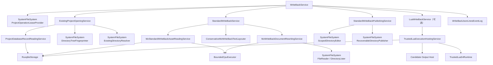

# MZ 写回流程

## 1. 用户结果与前置状态

```text
att [--config FILE] mz write-back --name NAME [--lua SCRIPT_LUA]
```

WriteBack 只使用 Init 冻结的 `source/data`、`source/js`、项目数据库中带当前 state 的
译文，以及 metadata 中三个实际布局宽度。成功结果固定发布到：

```text
<projects.root>/<name>/write_back/
├─ data/
└─ js/
```

命令先取得项目操作租约，再复核冻结来源 SHA-256、受管 schema 和全部 active owner
freshness。来源或 owner 不同代时直接失败，不混用资产；不同项目仍可并行。

## 2. 顶层顺序

`WriteBackService` 只打开一次项目，并把 Standard 与可选 Lua 的修改汇入同一个未发布
候选：

```text
取得 ProjectOperationLease
        ↓
ExistingProjectOpeningService
        ↓
StandardWriteBackService：读取、布局、重写
        ↓
StandardWriteBackPublishingService.prepare
        ↓ 显式传入 --lua
LuaWriteBackService 修改同一 candidate
        ↓
StandardWriteBackPublishingService.validate（无论是否运行 Lua）
        ↓
publish(token) 一次
        ↓
WriteBackJsonLinesEventLog.append(WriteBackRunLog)
        ↓
WriteBackOutput
```

Standard、Lua、候选验证或取消在 publish 前失败时，WriteBack 只调用一次
`discard(token)`，既有 `write_back` 保持不变。候选验证失败与 discard 失败分别保留，
清理错误不覆盖验证首因。publish 按值接管 token 后，上层等待其明确终态且不得再次
discard。

## 3. 依赖树



WriteBack 不构造 LLM，`ctx.llm` 为 nil。项目租约 → `write_back` 发布锁 → SQLite 是
唯一锁顺序；可信 Lua 也不能通过子进程重入同一个项目。

## 4. Standard 读取、布局与重写

Reader 在一个 SQLite statement 快照中读取五张标准资产表，解码 exact/group 位置，
并通过共享存储语义校验 owner、表种类、`unit_type`、来源、位置变体、Tag 容器和
translation/state。不可解码或语义矛盾都是项目数据库损坏，不猜测修复。

Layouter 只对三个 metadata 区域使用对应宽度：

- 对话正文；
- 滚动文本；
- 帮助/说明框。

译文中的已有换行是人工硬边界。无法证明自动布局安全时，Standard 保留完整译文并
产生结构化人工诊断；这是正常结果。Rewriter 在冻结文档中复核真实路径、事件命令码
和原文，再生成 data overlays，不直接修改 source、候选或固定输出。

## 5. 唯一候选与 Lua

Publisher 以 `ReplaceExisting` 准备一个候选：

```text
source/data → candidate/data
source/js   → candidate/js
Standard 重写文档 → candidate/data overlays
```

显式 Lua 只拿这个 candidate 的项目身份和根目录。`ctx.output` 提供候选内受控读写、
建目录和删除；`ctx.write_back.layout` 复用 Rust 布局器。脚本不能取得 publish 能力，
也不能把任意路径伪造成候选。

`ctx.db` 仍是完整 SQLite 逃生口。Lua 显式提交的数据库事务不会随 candidate discard
回滚；数据库提交和目录发布不是跨资源原子事务，脚本负责自身副作用的幂等语义。

## 6. 验证、发布与持久日志

可选 Lua 完成后，WriteBack 无条件调用 Publisher 的借用式 `validate(&candidate)`；
未选择 Lua 时也执行。Publisher 使用同一个文件系统根先把 scope 绑定到 candidate
物理身份，再重新枚举完整 candidate，要求根下恰好存在普通 `data/` 与 `js/` 树，并
重新检查 reparse point、硬链接、Windows 名称、物理逃逸、条目、深度、单文件和总
字节预算。验证只信任此刻的文件系统事实，不消费 token。

验证失败时 WriteBack 恰好丢弃一次 candidate；验证和 discard 双错同时上交。验证
通过并完成最终取消检查后只执行一次 `publish(token)`。目录根在实际交换前再次复核
候选，以覆盖校验与交换之间的状态变化；随后在同目标跨进程锁中使用 journal 与
handle rename 整体切换；`TargetMissing`、`TargetNotDirectory`、`NotAttempted`、
`NotPublished`、`PublishedWithResiduals`、`RecoveryRequired` 和 `OutcomeUnknown`
保持各自含义，业务层不自动重试或探测降级。

发布成功后，WriteBack 总控追加一个 `WriteBackRunLog`。事件包含项目、实际三个布局
宽度、输出根、Standard 汇总、完整人工布局诊断和 `lua_executed`；日志上下文提供同一
运行的 Windows UUID v4 `run_id`。只有 `write + LF + sync_data` 完成才确认持久化。
日志失败表示输出已经生效但命令技术失败，不回滚输出，也不误报未发布。

## 7. 可信 Lua 与收尾

Host 先 reserve Lua 5.4 VM 容量，再打开项目 SQLite 交互会话，最后同步 start 移交
calls 与唯一 finalizer。Lua 正常返回但留有活动事务时，Host 回滚并返回
`UnclosedTransaction`；主错误和清理错误同时保留。

命令结束后停止 Lua 准入并等待 finalizer，然后依次终结 SQLite、FileSystem、CPU 和
WriteBack Log。只有命令与全部 shutdown 都成功后才向 stdout 输出“写回完成”。
